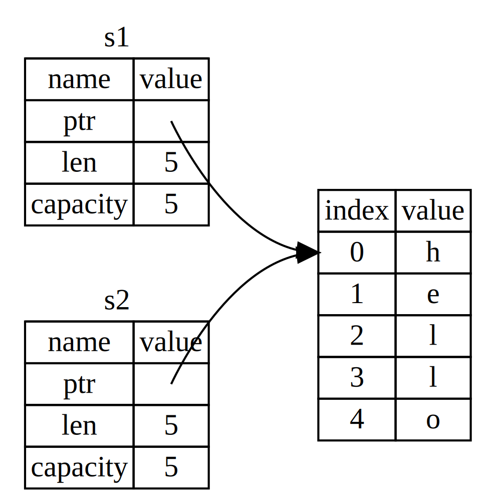
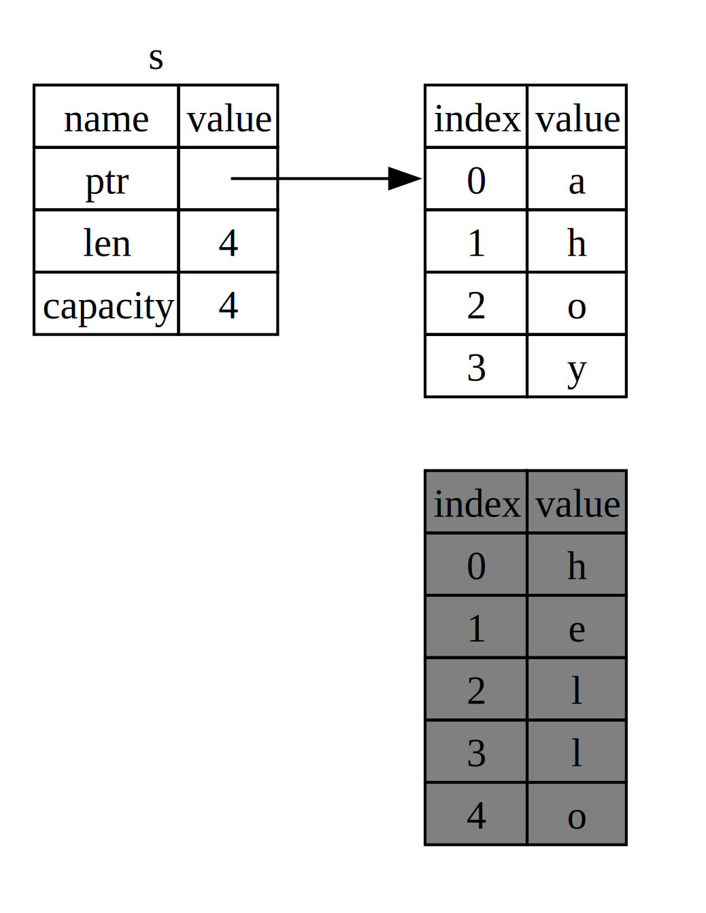

## O que é Ownership?

_Ownership_ é um conjunto de regras que governa como um programa Rust gerencia
a memória. Todo programa precisa gerenciar a forma como usa a memória do
computador durante a execução. Algumas linguagens têm garbage collection, que
procura regularmente por memória não utilizada enquanto o programa roda; em
outras, a pessoa programadora precisa alocar e liberar memória explicitamente.
Rust usa uma terceira abordagem: a memória é gerenciada por meio de um sistema
de ownership com um conjunto de regras verificadas pelo compilador. Se alguma
delas for violada, o programa não compila. Nenhum dos recursos de ownership
torna seu programa mais lento em tempo de execução.

Como ownership é um conceito novo para muita gente, leva algum tempo para se
acostumar. A boa notícia é que, quanto mais experiência você adquire com Rust e
com as regras do sistema de ownership, mais natural se torna escrever código
seguro e eficiente. Continue firme!

Ao entender ownership, você terá uma base sólida para compreender os recursos
que tornam o Rust único. Neste capítulo, aprenderemos ownership trabalhando com
alguns exemplos que se concentram em uma estrutura de dados muito comum:
strings.

> ### A pilha e o heap
>
> Muitas linguagens de programação não exigem que você pense na pilha e no
> amontoar com muita frequência. Mas em uma linguagem de programação de sistemas como Rust, seja um
> o valor está na pilha ou no heap afeta como a linguagem se comporta e por que
> você tem que tomar certas decisões. Partes de propriedade serão descritas em
> relação à pilha e ao heap mais adiante neste capítulo, então aqui está um breve
> explicação em preparação.
>
> Tanto a pilha quanto o heap são partes da memória disponíveis para seu código usar
> em tempo de execução, mas eles são estruturados de maneiras diferentes. A pilha armazena
> valores na ordem em que os obtém e remove os valores na ordem oposta
> ordem. Isso é conhecido como _último a entrar, primeiro a sair (LIFO)_. Pense em uma pilha de
> pratos: Ao adicionar mais pratos, você os coloca no topo da pilha e, quando
> você precisa de um prato, tire um de cima. Adicionar ou remover placas de
> o meio ou a parte inferior não funcionariam tão bem! Adicionar dados é chamado _pusing
> na pilha_, e a remoção de dados é chamada de _retirar da pilha_. Todos
> os dados armazenados na pilha devem ter um tamanho fixo e conhecido. Dados com um desconhecido
> tamanho em tempo de compilação ou um tamanho que pode mudar deve ser armazenado no heap
> em vez de.
>
> O heap é menos organizado: ao colocar dados no heap, você solicita um
> certa quantidade de espaço. O alocador de memória encontra um espaço vazio no heap
> que seja grande o suficiente, marca-o como em uso e retorna um _ponteiro_, que
> é o endereço desse local. Este processo é chamado _allocating no
> heap_ e às vezes é abreviado como apenas _allocating_ (enviando valores para
> a pilha não é considerada alocação). Como o ponteiro para o heap é um
> tamanho fixo e conhecido, você pode armazenar o ponteiro na pilha, mas quando quiser
> os dados reais, você deve seguir o ponteiro. Pense em estar sentado em um
> restaurante. Ao entrar, você informa o número de pessoas do seu grupo e
> o anfitrião encontra uma mesa vazia que cabe a todos e leva você até lá. Se
> alguém do seu grupo chegar atrasado, pode perguntar onde você se sentou
> encontrar você.
>
> Enviar para a pilha é mais rápido do que alocar no heap porque o
> o alocador nunca precisa procurar um local para armazenar novos dados; esse local é
> sempre no topo da pilha. Comparativamente, alocando espaço no heap
> requer mais trabalho porque o alocador deve primeiro encontrar um espaço grande o suficiente
> para manter os dados e, em seguida, realizar a contabilidade para se preparar para o próximo
> alocação.
>
> Acessar dados no heap geralmente é mais lento do que acessar dados no heap.
> pilha porque você precisa seguir um ponteiro para chegar lá. Contemporâneo
> os processadores são mais rápidos se movimentarem menos memória. Continuando o
> analogia, considere um garçom em um restaurante recebendo pedidos de muitas mesas.
> É mais eficiente reunir todos os pedidos em uma mesa antes de passar para
> a próxima mesa. Pegando um pedido da mesa A e depois um pedido da mesa B,
> então um de A novamente, e então um de B novamente seria muito mais lento
> processo. Da mesma forma, um processador geralmente pode fazer melhor seu trabalho se
> funciona em dados que estão próximos de outros dados (como estão na pilha), em vez de
> mais longe (como pode estar na pilha).
>
> Quando seu código chama uma função, os valores passados ​​para a função
> (incluindo, potencialmente, ponteiros para dados no heap) e a função
> variáveis ​​locais são colocadas na pilha. Quando a função terminar, aqueles
> os valores são retirados da pilha.
>
> Acompanhar quais partes do código estão usando quais dados no heap,
> minimizando a quantidade de dados duplicados no heap e limpando dados não utilizados
> dados na pilha para que você não fique sem espaço são todos problemas que
> endereços de propriedade. Depois de entender a propriedade, você não precisará pensar
> sobre a pilha e o heap com muita frequência. Mas sabendo que o objetivo principal
> propriedade é gerenciar dados heap pode ajudar a explicar por que funciona dessa maneira
> faz.

### Regras de propriedade

Primeiro, vamos dar uma olhada nas regras de propriedade. Tenha essas regras em mente enquanto
trabalhe com os exemplos que os ilustram:

- Cada valor em Rust possui um _proprietário_.
- Só pode haver um proprietário por vez.
- Quando o proprietário sai do escopo, o valor será eliminado.

### Escopo Variável

Agora que ultrapassamos a sintaxe básica do Rust, não incluiremos todos os `fn main() {`
código nos exemplos, então se você estiver acompanhando, certifique-se de colocar o
seguintes exemplos dentro de uma função `main` manualmente. Como resultado, nossos exemplos
será um pouco mais conciso, permitindo-nos focar nos detalhes reais em vez de
código padrão.

Como primeiro exemplo de propriedade, veremos o alcance de algumas variáveis. UM
_escopo_ é o intervalo dentro de um programa para o qual um item é válido. Pegue o
seguinte variável:

```rust
let s = "hello";
```

A variável `s` refere-se a uma string literal, onde o valor da string é
codificado no texto do nosso programa. A variável é válida a partir do ponto em
que é declarado até o final do escopo atual. A Listagem 4-1 mostra um
programa com comentários anotando onde a variável `s` seria válida.

<Listing number="4-1" caption="A variable and the scope in which it is valid">

```rust
{{#rustdoc_include ../listings/ch04-understanding-ownership/listing-04-01/src/main.rs:here}}
```

</Listing>

Em outras palavras, existem dois pontos importantes no tempo aqui:

- Quando `s` entra _no_ escopo, é válido.
- Permanece válido até sair _fora_ do escopo.

Neste ponto, a relação entre os escopos e quando as variáveis ​​são válidas é
semelhante ao de outras linguagens de programação. Agora vamos construir em cima disso
compreensão introduzindo o tipo `String`.

### O tipo `String`

Para ilustrar as regras de propriedade, precisamos de um tipo de dados mais complexo
do que aqueles que abordamos na seção [“Tipos de dados”][data-types]<!-- ignore -->
do Capítulo 3. Os tipos abordados anteriormente são de tamanho conhecido, podem ser armazenados
na pilha e retirados da pilha quando seu escopo terminar, e podem ser
copiado de forma rápida e trivial para criar uma instância nova e independente se outra
parte do código precisa usar o mesmo valor em um escopo diferente. Mas nós queremos
observe os dados armazenados no heap e explore como Rust sabe quando
limpe esses dados, e o tipo `String` é um ótimo exemplo.

Vamos nos concentrar nas partes de `String` relacionadas à propriedade. Esses
aspectos também se aplicam a outros tipos de dados complexos, sejam eles fornecidos por
a biblioteca padrão ou criada por você. Discutiremos aspectos de não propriedade de
`String` no [Capítulo 8][ch8]<!-- ignore -->.

Já vimos literais de string, onde um valor de string é codificado em nosso
programa. Literais de string são convenientes, mas não são adequados para todos
situação em que podemos querer usar texto. Uma razão é que eles são
imutável. Outra é que nem todo valor de string pode ser conhecido quando escrevemos
nosso código: por exemplo, e se quisermos pegar a entrada do usuário e armazená-la? Isso é
para essas situações o Rust possui o tipo `String`. Este tipo gerencia
dados alocados no heap e, como tal, é capaz de armazenar uma quantidade de texto que
é desconhecido para nós em tempo de compilação. Você pode criar um `String` a partir de uma string
literal usando a função `from`, assim:

```rust
let s = String::from("hello");
```

O operador de dois pontos duplos `::` nos permite nomear essa função `from`
específica sob o tipo `String`, em vez de usar algum nome como `string_from`.
Falaremos mais sobre essa sintaxe na seção [“Métodos”][methods]<!-- ignore -->
do Capítulo 5 e, quando tratarmos de namespace com módulos, em [“Caminhos para
Referenciar um Item na Árvore de Módulos”][paths-module-tree]<!-- ignore --> no
Capítulo 7.

Este tipo de string _pode_ sofrer mutação:

```rust
{{#rustdoc_include ../listings/ch04-understanding-ownership/no-listing-01-can-mutate-string/src/main.rs:here}}
```

Então, qual é a diferença aqui? Por que `String` pode sofrer mutação, mas literais
não pode? A diferença está na forma como esses dois tipos lidam com a memória.

### Memória e Alocação

No caso de uma string literal, conhecemos o conteúdo em tempo de compilação, então o
o texto é codificado diretamente no executável final. É por isso que a corda
literais são rápidos e eficientes. Mas essas propriedades só vêm da string
imutabilidade do literal. Infelizmente, não podemos colocar uma gota de memória no
binário para cada pedaço de texto cujo tamanho é desconhecido em tempo de compilação e cujo
o tamanho pode mudar durante a execução do programa.

Com o tipo `String`, para suportar um trecho de texto mutável e crescente,
precisamos alocar uma quantidade de memória no heap, desconhecida em tempo de compilação,
para segurar o conteúdo. Isso significa:

- A memória deve ser solicitada ao alocador de memória em tempo de execução.
- Precisamos de uma maneira de retornar essa memória ao alocador quando terminarmos
nosso `String`.

Essa primeira parte é feita por nós: Quando chamamos `String::from`, sua implementação
solicita a memória necessária. Isso é praticamente universal em programação
línguas.

No entanto, a segunda parte é diferente. Em idiomas com um coletor _garbage
(GC)_, o GC monitora e limpa a memória que não está sendo usada
mais, e não precisamos pensar sobre isso. Na maioria dos idiomas sem GC,
é nossa responsabilidade identificar quando a memória não está mais sendo usada e
chame o código para liberá-lo explicitamente, assim como fizemos para solicitá-lo. Fazendo isso
corretamente tem sido historicamente um problema de programação difícil. Se esquecermos,
vamos desperdiçar memória. Se fizermos isso muito cedo, teremos uma variável inválida. Se
fazemos isso duas vezes, isso também é um bug. Precisamos emparelhar exatamente um `allocate` com
exatamente um `free`.

Rust segue um caminho diferente: a memória é retornada automaticamente assim que o
variável que o possui sai do escopo. Aqui está uma versão do nosso exemplo de escopo
da Listagem 4-1 usando um `String` em vez de uma string literal:

```rust
{{#rustdoc_include ../listings/ch04-understanding-ownership/no-listing-02-string-scope/src/main.rs:here}}
```

Existe um ponto natural em que podemos devolver a memória que nosso `String` precisa
para o alocador: quando `s` sai do escopo. Quando uma variável sai de
escopo, Rust chama uma função especial para nós. Esta função é chamada
`drop`, e é onde o autor de `String` pode colocar
o código para retornar a memória. Rust chama `drop` automaticamente no fechamento
colchete.

> Nota: Em C++, esse padrão de desalocação de recursos no final da lista de um item
> o tempo de vida às vezes é chamado de _Aquisição de recursos é inicialização (RAII)_.
> A função `drop` em Rust será familiar para você se você usou RAII
> padrões.

Esse padrão tem um impacto profundo na forma como o código Rust é escrito. Pode parecer
simples agora, mas o comportamento do código pode ser inesperado em mais
situações complicadas quando queremos que múltiplas variáveis ​​usem os dados
alocamos na pilha. Vamos explorar algumas dessas situações agora.

<!-- Old headings. Do not remove or links may break. -->

<a id="ways-variables-and-data-interact-move"></a>

#### Variáveis ​​e dados interagindo com o Move

Múltiplas variáveis ​​podem interagir com os mesmos dados de maneiras diferentes no Rust.
A Listagem 4-2 mostra um exemplo usando um número inteiro.

<Listing number="4-2" caption="Assigning the integer value of variable `x` to `y`">

```rust
{{#rustdoc_include ../listings/ch04-understanding-ownership/listing-04-02/src/main.rs:here}}
```

</Listing>

Provavelmente podemos adivinhar o que isso está fazendo: “Ligue o valor `5` a `x`; então, faça
uma cópia do valor em `x` e vincule-o a `y`.” Agora temos duas variáveis, `x`
e `y`, e ambos iguais a `5`. Isto é realmente o que está acontecendo, porque inteiros
são valores simples com um tamanho fixo e conhecido, e esses dois valores `5` são enviados
na pilha.

Agora vamos dar uma olhada na versão `String`:

```rust
{{#rustdoc_include ../listings/ch04-understanding-ownership/no-listing-03-string-move/src/main.rs:here}}
```

Isto parece muito semelhante, então podemos assumir que a forma como funciona seria a
mesmo: Ou seja, a segunda linha faria uma cópia do valor em `s1` e vincularia
para `s2`. Mas não é bem isso que acontece.

Dê uma olhada na Figura 4-1 para ver o que está acontecendo com `String` sob o
capas. Um `String` é composto de três partes, mostradas à esquerda: um ponteiro para
a memória que contém o conteúdo da string, um comprimento e uma capacidade.
Este grupo de dados é armazenado na pilha. À direita está a memória do
heap que contém o conteúdo.


<span class="caption">Figura 4-1: A representação na memória de um `String`
mantendo o valor `"hello"` vinculado a `s1`</span>

O comprimento é a quantidade de memória, em bytes, que o conteúdo do `String` é
atualmente usando. A capacidade é a quantidade total de memória, em bytes, que o
`String` recebeu do alocador. A diferença entre comprimento e
a capacidade é importante, mas não neste contexto, então, por enquanto, não há problema em ignorar o
capacidade.

Quando atribuímos `s1` a `s2`, os dados `String` são copiados, o que significa que copiamos o
ponteiro, o comprimento e a capacidade que estão na pilha. Não copiamos o
dados no heap ao qual o ponteiro se refere. Em outras palavras, os dados
a representação na memória se parece com a Figura 4-2.



<span class="caption">Figura 4-2: A representação na memória da variável
`s2` que possui uma cópia do ponteiro, comprimento e capacidade de `s1`</span>

A representação _não_ se parece com a Figura 4-3, que é o que a memória
parece que Rust também copiou os dados do heap. Se Rust fez isso, o
operação `s2 = s1` poderia ser muito cara em termos de desempenho de tempo de execução se
os dados na pilha eram grandes.


<span class="caption">Figura 4-3: Outra possibilidade para o que `s2 = s1` poderia
faça se Rust copiou os dados do heap também</span>

Anteriormente, dissemos que quando uma variável sai do escopo, o Rust automaticamente
chama a função `drop` e limpa a memória heap dessa variável. Mas
A Figura 4-2 mostra ambos os ponteiros de dados apontando para o mesmo local. Este é um
problema: quando `s2` e `s1` saem do escopo, ambos tentarão liberar o
mesma memória. Isso é conhecido como erro _double free_ e é um dos erros de memória
bugs de segurança que mencionamos anteriormente. Liberar memória duas vezes pode levar à perda de memória
corrupção, que pode potencialmente levar a vulnerabilidades de segurança.

Para garantir a segurança da memória, após a linha `let s2 = s1;`, Rust considera `s1` como
não é mais válido. Portanto, Rust não precisa liberar nada quando `s1` vai
fora do escopo. Veja o que acontece quando você tenta usar `s1` depois que `s2` é
criado; não vai funcionar:

```rust,ignore,does_not_compile
{{#rustdoc_include ../listings/ch04-understanding-ownership/no-listing-04-cant-use-after-move/src/main.rs:here}}
```

Você receberá um erro como este porque o Rust impede que você use o
referência invalidada:

```console
{{#include ../listings/ch04-understanding-ownership/no-listing-04-cant-use-after-move/output.txt}}
```

Se você já ouviu os termos _cópia superficial_ e _cópia profunda_ enquanto trabalhava com
outras linguagens, o conceito de copiar o ponteiro, comprimento e capacidade
sem copiar os dados provavelmente parece fazer uma cópia superficial. Mas
porque Rust também invalida a primeira variável, em vez de ser chamada de
cópia superficial, é conhecida como _move_. Neste exemplo, diríamos que `s1`
foi _movido_ para `s2`. Então, o que realmente acontece é mostrado na Figura 4-4.


<span class="caption">Figura 4-4: A representação na memória após `s1` foi
foi invalidado</span>

Isso resolve nosso problema! Com apenas `s2` válido, quando sai do escopo
sozinho irá liberar a memória e pronto.

Além disso, há uma escolha de design que está implícita nisso: a ferrugem nunca
crie automaticamente cópias “profundas” de seus dados. Portanto, qualquer _automático_
a cópia pode ser considerada barata em termos de desempenho de tempo de execução.

#### Escopo e Atribuição

O inverso disso é verdadeiro para a relação entre escopo, propriedade e
memória sendo liberada por meio da função `drop` também. Quando você atribui um valor completamente
novo valor para uma variável existente, Rust chamará `drop` e liberará o original
memória do valor imediatamente. Considere este código, por exemplo:

```rust
{{#rustdoc_include ../listings/ch04-understanding-ownership/no-listing-04b-replacement-drop/src/main.rs:here}}
```

Inicialmente declaramos uma variável `s` e a vinculamos a `String` com o valor
`"hello"`. Então, criamos imediatamente um novo `String` com o valor `"ahoy"`
e atribua-o a `s`. Neste ponto, nada se refere ao valor original
na pilha. A Figura 4-5 ilustra os dados da pilha e do heap agora:



<span class="caption">Figura 4-5: A representação na memória após a inicial
o valor foi substituído em sua totalidade</span>

A string original sai imediatamente do escopo. Rust executará o `drop`
funcionará nele e sua memória será liberada imediatamente. Quando imprimimos o valor
no final, será `"ahoy, world!"`.

<!-- Old headings. Do not remove or links may break. -->

<a id="ways-variables-and-data-interact-clone"></a>

#### Variáveis ​​e dados interagindo com o clone

Se _queremos_ copiar profundamente os dados heap de `String`, não apenas o
empilhar dados, podemos usar um método comum chamado `clone`. Discutiremos o método
sintaxe no Capítulo 5, mas como os métodos são um recurso comum em muitos
linguagens de programação, você provavelmente já as viu antes.

Aqui está um exemplo do método `clone` em ação:

```rust
{{#rustdoc_include ../listings/ch04-understanding-ownership/no-listing-05-clone/src/main.rs:here}}
```

Isso funciona muito bem e produz explicitamente o comportamento mostrado na Figura 4-3,
onde os dados heap _são_ são copiados.

Quando você vê uma chamada para `clone`, você sabe que algum código arbitrário está sendo
executado e esse código pode ser caro. É um indicador visual de que algo
diferente está acontecendo.

#### Dados somente de pilha: copiar

Há outra ruga sobre a qual ainda não falamos. Este código usando
inteiros – parte dos quais foi mostrado na Listagem 4-2 – funcionam e são válidos:

```rust
{{#rustdoc_include ../listings/ch04-understanding-ownership/no-listing-06-copy/src/main.rs:here}}
```

Mas este código parece contradizer o que acabamos de aprender: não temos uma chamada para
`clone`, mas `x` ainda é válido e não foi movido para `y`.

A razão é que tipos como números inteiros que possuem um tamanho conhecido na compilação
o tempo é armazenado inteiramente na pilha, portanto, as cópias dos valores reais são rápidas
fazer. Isso significa que não há razão para querermos impedir que `x` seja
válido depois de criarmos a variável `y`. Em outras palavras, não há diferença
entre cópia profunda e superficial aqui, então ligar para `clone` não faria nada
diferente da cópia superficial usual, e podemos deixá-la de fora.

Rust tem uma anotação especial chamada `Copy` trait que podemos colocar
tipos que são armazenados na pilha, como os inteiros (falaremos mais sobre
características no [Capítulo 10][traits]<!-- ignore -->). Se um tipo implementa o `Copy`
trait, as variáveis ​​que o utilizam não se movem, mas são copiadas trivialmente,
tornando-os ainda válidos após a atribuição a outra variável.

Rust não nos permitirá anotar um tipo com `Copy` se o tipo, ou qualquer uma de suas partes,
implementou o traço `Drop`. Se o tipo precisa que algo especial aconteça
quando o valor sai do escopo e adicionamos a anotação `Copy` a esse tipo,
obteremos um erro em tempo de compilação. Para saber como adicionar a anotação `Copy`
ao seu tipo para implementar a característica, consulte [“Derivable
Características”][derivable-traits]<!-- ignore --> no Apêndice C.

Então, quais tipos implementam a característica `Copy`? Você pode verificar a documentação para
o tipo fornecido com certeza, mas como regra geral, qualquer grupo de escalares simples
valores podem implementar `Copy`, e nada que exija alocação ou seja algum
forma de recurso pode implementar `Copy`. Aqui estão alguns dos tipos que
implementar `Copy`:

- Todos os tipos inteiros, como `u32`.
- O tipo booleano, `bool`, com valores `true` e `false`.
- Todos os tipos de ponto flutuante, como `f64`.
- O tipo de caractere, `char`.
- Tuplas, se contiverem apenas tipos que também implementem `Copy`. Por exemplo,
`(i32, i32)` implementa `Copy`, mas `(i32, String)` não.

### Propriedade e Funções

A mecânica de passar um valor para uma função é semelhante àquelas quando
atribuir um valor a uma variável. Passar uma variável para uma função moverá ou
copiar, assim como a atribuição faz. A Listagem 4-3 tem um exemplo com algumas anotações
mostrando onde as variáveis ​​entram e saem do escopo.

<Listing number="4-3" file-name="src/main.rs" caption="Functions with ownership and scope annotated">

```rust
{{#rustdoc_include ../listings/ch04-understanding-ownership/listing-04-03/src/main.rs}}
```

</Listing>

Se tentássemos usar `s` após a chamada para `takes_ownership`, Rust lançaria um
erro em tempo de compilação. Essas verificações estáticas nos protegem de erros. Tente adicionar
código para `main` que usa `s` e `x` para ver onde você pode usá-los e onde
as regras de propriedade impedem que você faça isso.

### Valores de retorno e escopo

A devolução de valores também pode transferir a propriedade. A Listagem 4-4 mostra um exemplo de
função que retorna algum valor, com anotações semelhantes às da Listagem
4-3.

<Listing number="4-4" file-name="src/main.rs" caption="Transferring ownership of return values">

```rust
{{#rustdoc_include ../listings/ch04-understanding-ownership/listing-04-04/src/main.rs}}
```

</Listing>

A propriedade de uma variável sempre segue o mesmo padrão: Atribuir um
valor para outra variável o move. Quando uma variável que inclui dados sobre o
heap sai do escopo, o valor será limpo por `drop`, a menos que a propriedade
dos dados foi movido para outra variável.

Embora isso funcione, assumir a propriedade e depois devolvê-la a cada
função é um pouco tediosa. E se quisermos deixar uma função usar um valor, mas
não assumir a propriedade? É muito chato que tudo o que passamos também precise
ser repassado se quisermos usá-lo novamente, além de quaisquer dados resultantes
do corpo da função que também podemos querer retornar.

Rust nos permite retornar vários valores usando uma tupla, conforme mostrado na Listagem 4.5.

<Listing number="4-5" file-name="src/main.rs" caption="Returning ownership of parameters">

```rust
{{#rustdoc_include ../listings/ch04-understanding-ownership/listing-04-05/src/main.rs}}
```

</Listing>

Mas isso é muita cerimônia e muito trabalho para um conceito que deveria ser
comum. Felizmente para nós, Rust tem um recurso para usar um valor sem
transferência de propriedade: referências.

[data-types]: ch03-02-data-types.html#data-types
[ch8]: ch08-02-strings.html
[traits]: ch10-02-traits.html
[derivable-traits]: appendix-03-derivable-traits.html
[methods]: ch05-03-method-syntax.html#methods
[paths-module-tree]: ch07-03-paths-for-referring-to-an-item-in-the-module-tree.html
