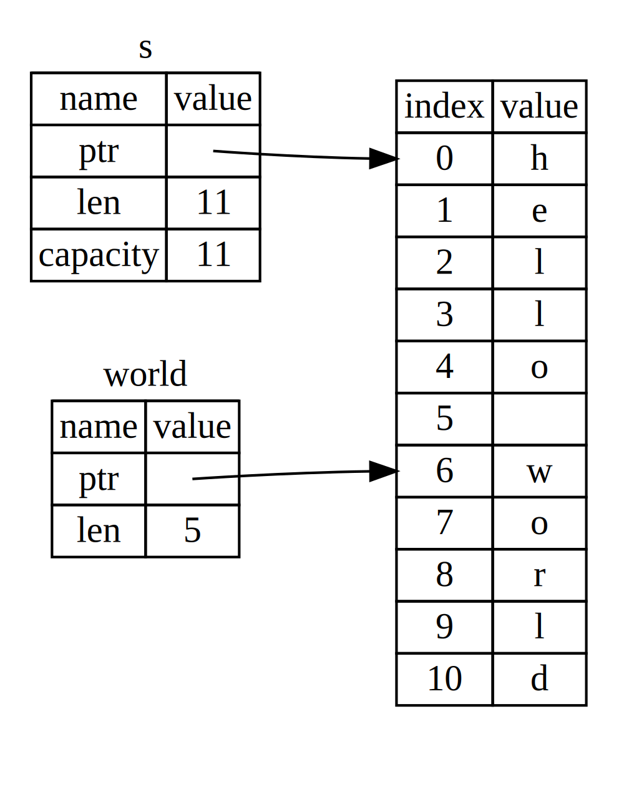

## O Tipo Slice

_Slices_ permitem referenciar uma sequência contígua de elementos em uma
[coleção](ch08-00-common-collections.md)<!-- ignore -->. Um slice é um tipo de
referência e, portanto, não tem ownership.

Aqui está um pequeno problema de programação: escreva uma função que receba uma
string composta por palavras separadas por espaços e retorne a primeira palavra
que encontrar nessa string. Se a função não encontrar um espaço na string,
então a string inteira deve ser considerada uma única palavra e, nesse caso, a
string inteira deve ser retornada.

> Observação: para fins de introdução a slices, nesta seção vamos assumir
> apenas ASCII; uma discussão mais completa sobre tratamento de UTF-8 aparece
> na seção [“Armazenando Texto Codificado em UTF-8 com
> Strings”][strings]<!-- ignore --> do Capítulo 8.

Vamos passar por como escreveríamos a assinatura dessa função sem usar slices,
para entender o problema que slices resolvem:

```rust,ignore
fn first_word(s: &String) -> ?
```

A função `first_word` recebe um parâmetro do tipo `&String`. Não precisamos de
ownership, então isso está ótimo. Em Rust idiomático, funções não assumem
ownership de seus argumentos a menos que precisem, e as razões para isso vão
ficar mais claras conforme avançarmos. Mas o que deveríamos retornar? Na
verdade, não temos uma forma de falar sobre *parte* de uma string. No entanto,
podemos retornar o índice do fim da palavra, indicado por um espaço. Vamos
tentar isso, como mostrado na Listagem 4-7.

<Listing number="4-7" file-name="src/main.rs" caption="A função `first_word` que retorna um índice de byte dentro do parâmetro `String`">

```rust
{{#rustdoc_include ../listings/ch04-understanding-ownership/listing-04-07/src/main.rs:here}}
```

</Listing>

Como precisamos percorrer a `String` elemento por elemento e verificar se um
valor é um espaço, vamos converter nossa `String` em um array de bytes usando o
método `as_bytes`.

```rust,ignore
{{#rustdoc_include ../listings/ch04-understanding-ownership/listing-04-07/src/main.rs:as_bytes}}
```

Em seguida, criamos um iterador sobre esse array de bytes usando o método
`iter`:

```rust,ignore
{{#rustdoc_include ../listings/ch04-understanding-ownership/listing-04-07/src/main.rs:iter}}
```

Discutiremos iteradores em mais detalhes no [Capítulo 13][ch13]<!-- ignore
-->. Por enquanto, saiba que `iter` é um método que retorna cada elemento de
uma coleção, e que `enumerate` envolve o resultado de `iter` e retorna cada
elemento como parte de uma tupla. O primeiro elemento da tupla retornada por
`enumerate` é o índice, e o segundo é uma referência ao elemento. Isso é um
pouco mais conveniente do que calcular o índice por conta própria.

Como o método `enumerate` retorna uma tupla, podemos usar padrões para
desestruturar essa tupla. Vamos falar mais sobre padrões no [Capítulo
6][ch6]<!-- ignore -->. No loop `for`, especificamos um padrão que usa `i`
para o índice na tupla e `&item` para o byte individual da tupla. Como
recebemos uma referência ao elemento de `.iter().enumerate()`, usamos `&` no
padrão.

Dentro do loop `for`, procuramos o byte que representa o espaço usando a
sintaxe de literal de byte. Se encontrarmos um espaço, retornamos sua posição.
Caso contrário, retornamos o comprimento da string usando `s.len()`.

```rust,ignore
{{#rustdoc_include ../listings/ch04-understanding-ownership/listing-04-07/src/main.rs:inside_for}}
```

Agora temos uma forma de descobrir o índice do fim da primeira palavra da
string, mas há um problema. Estamos retornando um `usize` por conta própria,
mas ele só é um número significativo no contexto da `&String`. Em outras
palavras, como ele é um valor separado da `String`, não há garantia de que
continuará válido no futuro. Considere o programa da Listagem 4-8, que usa a
função `first_word` da Listagem 4-7.

<Listing number="4-8" file-name="src/main.rs" caption="Armazenando o resultado de chamar `first_word` e depois alterando o conteúdo da `String`">

```rust
{{#rustdoc_include ../listings/ch04-understanding-ownership/listing-04-08/src/main.rs:here}}
```

</Listing>

Esse programa compila sem erro algum e também continuaria compilando se
usássemos `word` depois da chamada a `s.clear()`. Como `word` não está ligado
ao estado de `s`, ele ainda contém o valor `5`. Poderíamos usar esse valor `5`
junto com a variável `s` para tentar extrair a primeira palavra, mas isso
seria um bug, porque o conteúdo de `s` mudou desde que salvamos `5` em `word`.

Ter de se preocupar com o índice em `word` ficando fora de sincronia com os
dados em `s` é tedioso e propenso a erros! Gerenciar esses índices fica ainda
mais frágil se escrevermos uma função `second_word`. A assinatura dela teria de
ser algo assim:

```rust,ignore
fn second_word(s: &String) -> (usize, usize) {
```

Agora estamos acompanhando um índice de início _e_ um de fim, e temos ainda
mais valores calculados a partir de dados em um estado específico, mas que não
estão ligados a esse estado de forma alguma. Temos três variáveis soltas e sem
relação direta, que precisam permanecer sincronizadas.

Felizmente, o Rust tem uma solução para esse problema: string slices.

### String Slices

Um _string slice_ é uma referência a uma sequência contígua de elementos de uma
`String`, e ele se parece com isto:

```rust
{{#rustdoc_include ../listings/ch04-understanding-ownership/no-listing-17-slice/src/main.rs:here}}
```

Em vez de ser uma referência para a `String` inteira, `hello` é uma referência
para uma parte da `String`, especificada pelo trecho adicional `[0..5]`.
Criamos slices usando um intervalo entre colchetes, especificando
`[starting_index..ending_index]`, em que _`starting_index`_ é a primeira
posição do slice e _`ending_index`_ é uma posição além da última. Internamente,
a estrutura de dados do slice armazena a posição inicial e o comprimento do
slice, que corresponde a _`ending_index`_ menos _`starting_index`_. Assim, no
caso de `let world = &s[6..11];`, `world` seria um slice contendo um ponteiro
para o byte no índice 6 de `s` com um valor de comprimento igual a `5`.

A Figura 4-7 mostra isso em um diagrama.



<span class="caption">Figura 4-7: Um string slice referindo-se a parte de uma
`String`</span>

Com a sintaxe de intervalo `..` do Rust, se você quiser começar do índice 0,
pode omitir o valor antes dos dois pontos. Em outras palavras, estes dois
trechos são equivalentes:

```rust
let s = String::from("hello");

let slice = &s[0..2];
let slice = &s[..2];
```

Da mesma forma, se o seu slice incluir o último byte da `String`, você pode
omitir o número final. Isso significa que estes trechos são equivalentes:

```rust
let s = String::from("hello");

let len = s.len();

let slice = &s[3..len];
let slice = &s[3..];
```

Você também pode omitir ambos os valores para pegar um slice da string inteira.
Logo, estes trechos também são equivalentes:

```rust
let s = String::from("hello");

let len = s.len();

let slice = &s[0..len];
let slice = &s[..];
```

> Observação: os índices de intervalo de string slices precisam ocorrer em
> limites válidos de caracteres UTF-8. Se você tentar criar um string slice no
> meio de um caractere multibyte, seu programa será encerrado com erro.

Com todas essas informações em mente, vamos reescrever `first_word` para
retornar um slice. O tipo que significa “string slice” é escrito como `&str`:

<Listing file-name="src/main.rs">

```rust
{{#rustdoc_include ../listings/ch04-understanding-ownership/no-listing-18-first-word-slice/src/main.rs:here}}
```

</Listing>

Obtemos o índice do fim da palavra da mesma forma que fizemos na Listagem 4-7,
procurando a primeira ocorrência de um espaço. Quando encontramos um espaço,
retornamos um string slice usando o começo da string e o índice do espaço como
índices inicial e final.

Agora, quando chamamos `first_word`, recebemos de volta um único valor ligado
aos dados subjacentes. O valor é composto por uma referência ao ponto inicial
do slice e pelo número de elementos do slice.

Retornar um slice também funcionaria para uma função `second_word`:

```rust,ignore
fn second_word(s: &String) -> &str {
```

Agora temos uma API simples e muito mais difícil de estragar, porque o
compilador garante que as referências para dentro da `String` continuem
válidas. Lembra do bug no programa da Listagem 4-8, quando obtivemos o índice
do fim da primeira palavra, mas depois limpamos a string e, com isso, esse
índice ficou inválido? Aquele código estava logicamente incorreto, mas não
mostrava nenhum erro imediatamente. Os problemas só apareceriam depois, se
continuássemos tentando usar o índice da primeira palavra com uma string já
esvaziada. Slices tornam esse bug impossível e nos avisam muito mais cedo de
que há um problema no código. Usar a versão com slice de `first_word` vai gerar
um erro de compilação:

<Listing file-name="src/main.rs">

```rust,ignore,does_not_compile
{{#rustdoc_include ../listings/ch04-understanding-ownership/no-listing-19-slice-error/src/main.rs:here}}
```

</Listing>

Este é o erro do compilador:

```console
{{#include ../listings/ch04-understanding-ownership/no-listing-19-slice-error/output.txt}}
```

Lembre-se, pelas regras de borrowing, que se temos uma referência imutável para
alguma coisa, também não podemos pegar uma referência mutável para essa mesma
coisa. Como `clear` precisa truncar a `String`, ele precisa obter uma
referência mutável. O `println!` após a chamada a `clear` usa a referência em
`word`, então a referência imutável ainda precisa estar ativa naquele ponto. O
Rust proíbe que a referência mutável em `clear` e a referência imutável em
`word` existam ao mesmo tempo, e a compilação falha. O Rust não apenas tornou
nossa API mais fácil de usar como também eliminou toda uma classe de erros em
tempo de compilação!

<!-- Old headings. Do not remove or links may break. -->

<a id="string-literals-are-slices"></a>

#### Literais de String como Slices

Lembre-se de que falamos sobre literais de string serem armazenados dentro do
binário. Agora que sabemos sobre slices, conseguimos entender corretamente os
literais de string:

```rust
let s = "Hello, world!";
```

O tipo de `s` aqui é `&str`: é um slice apontando para aquele ponto específico
do binário. Essa é também a razão pela qual literais de string são imutáveis:
`&str` é uma referência imutável.

#### String Slices como Parâmetros

Saber que você pode obter slices de literais e de valores `String` nos leva a
mais uma melhoria em `first_word`, que é sua assinatura:

```rust,ignore
fn first_word(s: &String) -> &str {
```

Um rustaceano mais experiente escreveria a assinatura mostrada na Listagem 4-9,
porque ela nos permite usar a mesma função tanto com valores `&String` quanto
com valores `&str`.

<Listing number="4-9" caption="Melhorando a função `first_word` ao usar um string slice como tipo do parâmetro `s`">

```rust,ignore
{{#rustdoc_include ../listings/ch04-understanding-ownership/listing-04-09/src/main.rs:here}}
```

</Listing>

Se tivermos um string slice, podemos passá-lo diretamente. Se tivermos uma
`String`, podemos passar um slice da `String` ou uma referência à `String`.
Essa flexibilidade aproveita coerções de deref, um recurso que veremos na seção
[“Usando Coerções de Deref em Funções e Métodos”][deref-coercions]<!-- ignore
--> do Capítulo 15.

Definir uma função para receber um string slice em vez de uma referência para
`String` torna nossa API mais geral e útil, sem perder nenhuma funcionalidade:

<Listing file-name="src/main.rs">

```rust
{{#rustdoc_include ../listings/ch04-understanding-ownership/listing-04-09/src/main.rs:usage}}
```

</Listing>

### Outros Slices

String slices, como você pode imaginar, são específicos para strings. Mas
existe também um tipo mais geral de slice. Considere este array:

```rust
let a = [1, 2, 3, 4, 5];
```

Assim como podemos querer nos referir a parte de uma string, podemos querer
nos referir a parte de um array. Faríamos isso assim:

```rust
let a = [1, 2, 3, 4, 5];

let slice = &a[1..3];

assert_eq!(slice, &[2, 3]);
```

Esse slice tem o tipo `&[i32]`. Ele funciona da mesma maneira que string
slices, armazenando uma referência ao primeiro elemento e um comprimento. Você
usará esse tipo de slice para vários outros tipos de coleção. Vamos discutir
essas coleções em detalhe quando falarmos sobre vetores no Capítulo 8.

## Resumo

Os conceitos de ownership, borrowing e slices garantem segurança de memória em
programas Rust em tempo de compilação. A linguagem Rust dá a você controle
sobre o uso da memória da mesma forma que outras linguagens de programação de
sistemas. Mas ter o dono dos dados limpando automaticamente esses dados quando
ele sai de escopo significa que você não precisa escrever e depurar código
extra para obter esse controle.

Ownership afeta o funcionamento de muitas outras partes do Rust, então vamos
falar mais sobre esses conceitos ao longo do restante do livro. Vamos agora
para o Capítulo 5 e ver como agrupar pedaços de dados em uma `struct`.

[ch13]: ch13-02-iterators.html
[ch6]: ch06-02-match.html#patterns-that-bind-to-values
[strings]: ch08-02-strings.html#storing-utf-8-encoded-text-with-strings
[deref-coercions]: ch15-02-deref.html#using-deref-coercions-in-functions-and-methods
