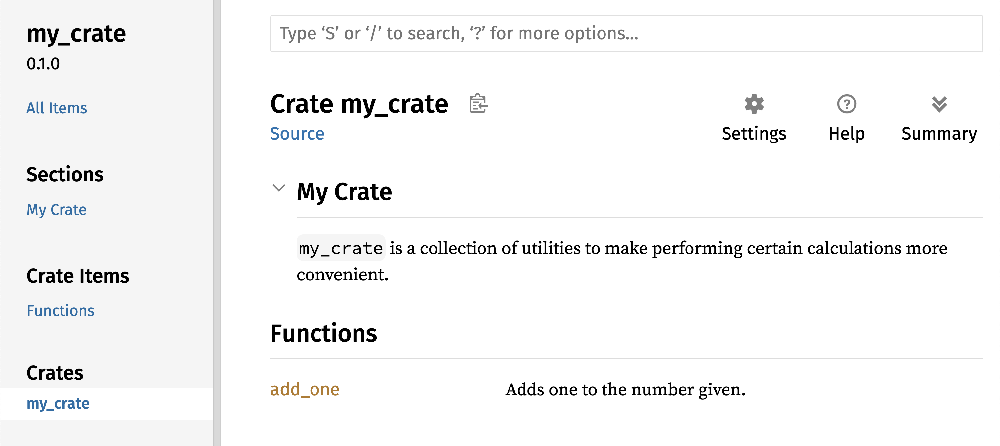

## Publicando um Crate no Crates.io

Usamos pacotes de [crates.io](https://crates.io/)<!-- ignore --> como
dependências do nosso projeto, mas você também pode compartilhar seu código com
outras pessoas publicando seus próprios pacotes. O registro de crates em
[crates.io](https://crates.io/)<!-- ignore --> distribui o código-fonte dos
seus pacotes, por isso hospeda principalmente código open source.

Rust e Cargo têm recursos que tornam seu pacote publicado mais fácil de
encontrar e usar. Falaremos sobre alguns desses recursos a seguir e depois
explicaremos como publicar um pacote.

### Criando Comentários de Documentação Úteis

Documentar com precisão seus pacotes ajudará outros usuários a saber como e
quando usá-los, então vale a pena investir tempo na documentação. No Capítulo
3, discutimos como comentar código Rust usando duas barras, `//`. O Rust também
tem um tipo específico de comentário para documentação, convenientemente
conhecido como _comentário de documentação_, que gera documentação HTML. O HTML
exibe o conteúdo dos comentários de documentação de itens públicos da API,
destinados a programadores interessados em saber como _usar_ seu crate, em vez
de como ele está _implementado_.

Comentários de documentação usam três barras, `///`, em vez de duas, e
suportam Markdown para formatar o texto. Coloque comentários de documentação
imediatamente antes do item que eles documentam. A Listagem 14-1 mostra
comentários de documentação para uma função `add_one` em um crate chamado
`my_crate`.

<Listing number="14-1" file-name="src/lib.rs" caption="Um comentário de documentação para uma função">

```rust,ignore
{{#rustdoc_include ../listings/ch14-more-about-cargo/listing-14-01/src/lib.rs}}
```

</Listing>

Aqui descrevemos o que a função `add_one` faz, iniciamos uma seção com o título
`Examples` e, em seguida, fornecemos código que demonstra como usar a função
`add_one`. Podemos gerar a documentação HTML a partir desse comentário de
documentação executando `cargo doc`. Esse comando executa a ferramenta
`rustdoc`, distribuída com o Rust, e coloca a documentação HTML gerada no
diretório _target/doc_.

Por conveniência, executar `cargo doc --open` gerará o HTML da documentação do
crate atual, bem como a documentação de todas as dependências, e abrirá o
resultado em um navegador. Navegue até a função `add_one` e você verá como o
texto nos comentários de documentação é renderizado, como mostrado na Figura
14-1.


<span class="caption">Figura 14-1: A documentação HTML do `add_one`
função</span>

#### Seções Usadas com Frequência

Usamos o heading Markdown `# Examples` na Listagem 14-1 para criar uma seção no
HTML com o título “Exemplos”. Aqui estão algumas outras seções que autores de
crates usam com frequência em sua documentação:

- **Pânicos**: são os cenários em que a função documentada pode entrar em
  pânico. Chamadores que não desejam que seus programas entrem em pânico devem
  garantir que não chamem a função nessas situações.
- **Erros**: se a função retornar um `Result`, descrever que tipos de erro
  podem ocorrer e em quais condições eles podem ser retornados pode ser útil
  para os chamadores, para que possam escrever código para lidar com os
  diferentes tipos de erro de maneiras diferentes.
- **Segurança**: se a função for `unsafe` de chamar, como discutiremos no
  Capítulo 20, deve haver uma seção explicando por que a função não é segura e
  cobrindo as invariantes que ela espera que os chamadores mantenham.

A maioria dos comentários de documentação não precisa de todas essas seções,
mas esta é uma boa lista de verificação para lembrar os aspectos sobre os quais
os usuários do seu código terão interesse em saber.

#### Comentários de Documentação como Testes

Adicionar blocos de código de exemplo aos comentários de documentação pode
ajudar a demonstrar como usar sua biblioteca e ainda traz um bônus adicional:
executar `cargo test` fará com que os exemplos de código na documentação sejam
executados como testes! Nada é melhor do que documentação com exemplos. Mas
nada é pior do que exemplos que não funcionam porque o código mudou desde que a
documentação foi escrita. Se executarmos `cargo test` com a documentação da
função `add_one` da Listagem 14-1, veremos uma seção nos resultados de teste
semelhante a esta:

<!-- manual-regeneration
cd listings/ch14-more-about-cargo/listing-14-01/
cargo test
copy just the doc-tests section below
-->

```text
   Doc-tests my_crate

running 1 test
test src/lib.rs - add_one (line 5) ... ok

test result: ok. 1 passed; 0 failed; 0 ignored; 0 measured; 0 filtered out; finished in 0.27s
```

Agora, se mudarmos a função ou o exemplo de modo que o `assert_eq!` do exemplo
entre em pânico e executarmos `cargo test` novamente, veremos que os doc-tests
capturam o fato de que o exemplo e o código estão fora de sincronia!

<!-- Old headings. Do not remove or links may break. -->

<a id="commenting-contained-items"></a>

#### Comentários em Itens Contêineres

O estilo de comentário de documentação `//!` adiciona documentação ao item que
*contém* os comentários, e não aos itens que vêm *depois* deles. Normalmente,
usamos esse tipo de comentário dentro do arquivo raiz do crate (_src/lib.rs_,
por convenção) ou dentro de um módulo, para documentar o crate ou o módulo como
um todo.

Por exemplo, para adicionar documentação que descreva a finalidade do crate
`my_crate`, que contém a função `add_one`, adicionamos comentários de
documentação que começam com `//!` no início do arquivo _src/lib.rs_, como
mostrado na Listagem 14-2.

<Listing number="14-2" file-name="src/lib.rs" caption="A documentação do crate `my_crate` como um todo">

```rust,ignore
{{#rustdoc_include ../listings/ch14-more-about-cargo/listing-14-02/src/lib.rs:here}}
```

</Listing>

Observe que não há código algum após a última linha que começa com `//!`. Como
iniciamos os comentários com `//!`, em vez de `///`, estamos documentando o
item que contém esse comentário, e não um item que o segue. Neste caso, esse
item é o arquivo _src/lib.rs_, que é a raiz do crate. Esses comentários
descrevem o crate inteiro.

Quando executamos `cargo doc --open`, esses comentários são exibidos na página
inicial da documentação de `my_crate`, acima da lista de itens públicos do
crate, como mostrado na Figura 14-2.

Comentários de documentação em itens contêineres são especialmente úteis para
descrever crates e módulos. Use-os para explicar o propósito geral do contêiner
e ajudar seus usuários a entender a organização do crate.



<span class="caption">Figura 14-2: A documentação renderizada para `my_crate`,
incluindo o comentário que descreve o crate como um todo</span>

<!-- Old headings. Do not remove or links may break. -->

<a id="exporting-a-convenient-public-api-with-pub-use"></a>

### Exportando uma API Pública Conveniente

A estrutura da sua API pública é uma consideração importante ao publicar um
crate. As pessoas que usam seu crate estão menos familiarizadas com essa
estrutura do que você e podem ter dificuldade para encontrar as partes que
desejam usar se o crate tiver uma grande hierarquia de módulos.

No Capítulo 7, vimos como tornar itens públicos usando a palavra-chave `pub` e
como trazer itens para um escopo com a palavra-chave `use`. No entanto, a
estrutura que faz sentido para você enquanto desenvolve um crate talvez não
seja muito conveniente para seus usuários. Você pode querer organizar suas
structs em uma hierarquia com vários níveis, mas as pessoas que quiserem usar
um tipo definido profundamente nessa hierarquia talvez tenham dificuldade até
para descobrir que esse tipo existe. Elas também podem se incomodar por ter de
escrever `use my_crate::some_module::another_module::UsefulType;` em vez de
`use my_crate::UsefulType;`.

A boa notícia é que, se essa estrutura _não_ for conveniente para outras
pessoas usarem a partir de outra biblioteca, você não precisa reorganizar sua
estrutura interna. Em vez disso, pode reexportar itens para criar uma estrutura
pública diferente da privada usando `pub use`. *Reexportar* pega um item
público em um local e o torna público em outro, como se ele tivesse sido
definido ali.

Por exemplo, digamos que criamos uma biblioteca chamada `art` para modelar
conceitos artísticos. Dentro dela há dois módulos: um módulo `kinds`,
contendo dois enums chamados `PrimaryColor` e `SecondaryColor`, e um módulo
`utils`, contendo uma função chamada `mix`, como mostrado na Listagem 14-3.

<Listing number="14-3" file-name="src/lib.rs" caption="Uma biblioteca `art` com itens organizados nos módulos `kinds` e `utils`">

```rust,noplayground,test_harness
{{#rustdoc_include ../listings/ch14-more-about-cargo/listing-14-03/src/lib.rs:here}}
```

</Listing>

A Figura 14-3 mostra como seria a página inicial da documentação desse crate
gerada por `cargo doc`.


<span class="caption">Figura 14-3: A primeira página da documentação do `art`
que lista os módulos ` kinds`e ` utils`</span>

Observe que os tipos `PrimaryColor` e `SecondaryColor` não aparecem na página
inicial, nem a função `mix`. Precisamos clicar em `kinds` e `utils` para vê-los.

Outro crate que dependa dessa biblioteca precisaria de instruções `use` que
trouxessem os itens de `art` para o escopo, especificando a estrutura de
módulos atualmente definida. A Listagem 14-4 mostra um exemplo de crate que usa
os itens `PrimaryColor` e `mix` do crate `art`.

<Listing number="14-4" file-name="src/main.rs" caption="Um crate usando os itens do crate `art` com sua estrutura interna exportada">

```rust,ignore
{{#rustdoc_include ../listings/ch14-more-about-cargo/listing-14-04/src/main.rs}}
```

</Listing>

O autor do código da Listagem 14-4, que usa o crate `art`, teve de descobrir
que `PrimaryColor` está no módulo `kinds` e `mix` no módulo `utils`. A
estrutura de módulos do crate `art` é mais relevante para quem trabalha nele do
que para quem apenas o utiliza. Essa estrutura interna não traz nenhuma
informação útil para alguém que está tentando entender como usar o crate `art`;
em vez disso, causa confusão, porque os desenvolvedores que o utilizam precisam
descobrir onde procurar e especificar os nomes dos módulos nas instruções
`use`.

Para remover a organização interna da API pública, podemos modificar o código
do crate `art` da Listagem 14-3 para adicionar instruções `pub use` que
reexportem os itens no nível superior, como mostrado na Listagem 14-5.

<Listing number="14-5" file-name="src/lib.rs" caption="Adicionando instruções `pub use` para reexportar itens">

```rust,ignore
{{#rustdoc_include ../listings/ch14-more-about-cargo/listing-14-05/src/lib.rs:here}}
```

</Listing>

A documentação da API que `cargo doc` gera para esse crate agora listará e
apontará para as reexportações na página inicial, como mostrado na Figura 14-4,
tornando os tipos `PrimaryColor` e `SecondaryColor`, assim como a função
`mix`, mais fáceis de encontrar.


<span class="caption">Figura 14-4: A primeira página da documentação do `art`
que lista as reexportações</span>

Os usuários do crate `art` ainda podem ver e usar a estrutura interna da
Listagem 14-3, como demonstrado na Listagem 14-4, ou podem usar a estrutura
mais conveniente da Listagem 14-5, como mostrado na Listagem 14-6.

<Listing number="14-6" file-name="src/main.rs" caption="Um programa usando os itens reexportados do crate `art`">

```rust,ignore
{{#rustdoc_include ../listings/ch14-more-about-cargo/listing-14-06/src/main.rs:here}}
```

</Listing>

Nos casos em que há muitos módulos aninhados, reexportar os tipos no nível
superior com `pub use` pode fazer uma diferença significativa na experiência
das pessoas que usam o crate. Outro uso comum de `pub use` é reexportar
definições de uma dependência no crate atual para fazer com que essas
definições passem a fazer parte da API pública do seu crate.

Criar uma estrutura de API pública útil é mais uma arte do que uma ciência, e
você pode iterar até encontrar a API que funciona melhor para seus usuários.
Escolher `pub use` oferece flexibilidade na forma como você estrutura seu crate
internamente e desacopla essa estrutura interna daquilo que apresenta aos
usuários. Veja o código de alguns crates que você instalou para observar se a
estrutura interna deles difere da API pública.

### Configurando uma Conta no Crates.io

Antes de publicar qualquer crate, você precisa criar uma conta no
[crates.io](https://crates.io/)<!-- ignore --> e obter um token de API. Para
fazer isso, visite a página inicial em
[crates.io](https://crates.io/)<!-- ignore --> e faça login por meio de uma
conta do GitHub. (Atualmente, a conta do GitHub é um requisito, mas o site
pode oferecer suporte a outras formas de criação de conta no futuro.) Depois de
fazer login, visite as configurações da sua conta em
[https://crates.io/me/](https://crates.io/me/)<!-- ignore --> e recupere sua
chave de API. Em seguida, execute o comando `cargo login` e cole essa chave
quando solicitado, assim:

```console
$ cargo login
abcdefghijklmnopqrstuvwxyz012345
```

Esse comando informará ao Cargo o seu token de API e o armazenará localmente em
_~/.cargo/credentials.toml_. Observe que esse token é um segredo: não o
compartilhe com ninguém. Se você o compartilhar com alguém por qualquer motivo,
deverá revogá-lo e gerar um novo token em
[crates.io](https://crates.io/)<!-- ignore
-->.

### Adicionando Metadados a um Novo Crate

Digamos que você tenha um crate que deseja publicar. Antes de publicá-lo, será
necessário adicionar alguns metadados na seção `[package]` do arquivo
_Cargo.toml_ do crate.

Seu crate precisará de um nome único. Enquanto estiver trabalhando localmente,
você pode dar a ele o nome que quiser. No entanto, os nomes de crates em
[crates.io](https://crates.io/)<!-- ignore --> são alocados por ordem de
chegada. Depois que um nome é usado, ninguém mais pode publicar um crate com
esse nome. Antes de tentar publicar um crate, pesquise o nome que você quer
usar. Se ele já tiver sido usado, será necessário encontrar outro nome e editar
o campo `name` no arquivo _Cargo.toml_, na seção `[package]`, para usar o novo
nome na publicação, assim:

<span class="filename">Nome do arquivo: Cargo.toml</span>

```toml
[package]
name = "guessing_game"
```

Mesmo que você tenha escolhido um nome único, ao executar `cargo publish` para
publicar o crate neste ponto, receberá um aviso e, em seguida, um erro:

<!-- manual-regeneration
Create a new package with an unregistered name, making no further modifications
  to the generated package, so it is missing the description and license fields.
cargo publish
copy just the relevant lines below
-->

```console
$ cargo publish
    Updating crates.io index
warning: manifest has no description, license, license-file, documentation, homepage or repository.
See https://doc.rust-lang.org/cargo/reference/manifest.html#package-metadata for more info.
--snip--
error: failed to publish to registry at https://crates.io

Caused by:
  the remote server responded with an error (status 400 Bad Request): missing or empty metadata fields: description, license. Please see https://doc.rust-lang.org/cargo/reference/manifest.html for more information on configuring these fields
```

Isso resulta em um erro porque faltam algumas informações cruciais: descrição e
licença são necessárias para que as pessoas saibam o que seu crate faz e sob
quais termos ele pode ser usado. Em _Cargo.toml_, adicione uma descrição de uma
ou duas frases, porque ela aparecerá junto do crate nos resultados de busca.
Para o campo `license`, você precisa fornecer um identificador de licença. A
[Software Package Data Exchange (SPDX), da Linux Foundation][spdx], lista os
identificadores que você pode usar nesse valor. Por exemplo, para especificar
que você licenciou seu crate usando a licença MIT, adicione o identificador
`MIT`:

<span class="filename">Nome do arquivo: Cargo.toml</span>

```toml
[package]
name = "guessing_game"
license = "MIT"
```

Se você quiser usar uma licença que não apareça na SPDX, precisará colocar o
texto dessa licença em um arquivo, incluí-lo no projeto e então usar
`license-file` para especificar o nome desse arquivo em vez de usar a chave
`license`.

Orientações sobre qual licença é apropriada para o seu projeto estão fora do
escopo deste livro. Muitas pessoas na comunidade Rust licenciam seus projetos
da mesma forma que o Rust, usando uma licença dupla `MIT OR Apache-2.0`. Essa
prática mostra que você também pode especificar múltiplos identificadores de
licença separados por `OR` para ter múltiplas licenças em seu projeto.

Com um nome único, a versão, a descrição e uma licença adicionados, o arquivo
_Cargo.toml_ de um projeto pronto para publicação pode ter a seguinte
aparência:

<span class="filename">Nome do arquivo: Cargo.toml</span>

```toml
[package]
name = "guessing_game"
version = "0.1.0"
edition = "2024"
description = "A fun game where you guess what number the computer has chosen."
license = "MIT OR Apache-2.0"

[dependencies]
```

[A documentação do Cargo](https://doc.rust-lang.org/cargo/) descreve outros
metadados que você pode especificar para ajudar outras pessoas a descobrir e
usar seu crate com mais facilidade.

### Publicando no Crates.io

Agora que você criou uma conta, salvou seu token de API, escolheu um nome para
o crate e especificou os metadados necessários, está pronto para publicar!
Publicar um crate envia uma versão específica para
[crates.io](https://crates.io/)<!-- ignore --> para que outras pessoas possam
usá-la.

Tenha cuidado, porque uma publicação é _permanente_. A versão nunca pode ser
sobrescrita, e o código não pode ser excluído, exceto em determinadas
circunstâncias. Um dos principais objetivos do Crates.io é atuar como um
arquivo permanente de código, para que builds de todos os projetos que dependem
de crates de [crates.io](https://crates.io/)<!-- ignore --> continuem
funcionando. Permitir exclusões de versões tornaria esse objetivo impossível de
cumprir. No entanto, não há limite para o número de versões de crate que você
pode publicar.

Execute o comando `cargo publish` novamente. Agora ele deve funcionar:

<!-- manual-regeneration
go to some valid crate, publish a new version
cargo publish
copy just the relevant lines below
-->

```console
$ cargo publish
    Updating crates.io index
   Packaging guessing_game v0.1.0 (file:///projects/guessing_game)
    Packaged 6 files, 1.2KiB (895.0B compressed)
   Verifying guessing_game v0.1.0 (file:///projects/guessing_game)
   Compiling guessing_game v0.1.0
(file:///projects/guessing_game/target/package/guessing_game-0.1.0)
    Finished `dev` profile [unoptimized + debuginfo] target(s) in 0.19s
   Uploading guessing_game v0.1.0 (file:///projects/guessing_game)
    Uploaded guessing_game v0.1.0 to registry `crates-io`
note: waiting for `guessing_game v0.1.0` to be available at registry
`crates-io`.
You may press ctrl-c to skip waiting; the crate should be available shortly.
   Published guessing_game v0.1.0 at registry `crates-io`
```

Parabéns! Agora você compartilhou seu código com a comunidade Rust, e qualquer
pessoa pode adicionar facilmente seu crate como dependência do próprio projeto.

### Publicando uma Nova Versão de um Crate Existente

Quando você fizer alterações no crate e estiver pronto para lançar uma nova
versão, altere o valor `version` especificado em _Cargo.toml_ e publique
novamente. Use as [regras de Versionamento Semântico][semver] para decidir qual
é o próximo número de versão apropriado, com base nos tipos de alteração que
você fez. Em seguida, execute `cargo publish` para enviar a nova versão.

<!-- Old headings. Do not remove or links may break. -->

<a id="removing-versions-from-cratesio-with-cargo-yank"></a>
<a id="deprecating-versions-from-cratesio-with-cargo-yank"></a>

### Descontinuando versões do Crates.io

Embora não seja possível remover versões anteriores de um crate, você pode
impedir que projetos futuros as adicionem como nova dependência. Isso é útil
quando uma versão do crate está quebrada por um motivo ou outro. Nessas
situações, o Cargo oferece suporte a tornar uma versão indisponível por meio de
`yank`.

Dar `yank` em uma versão impede que novos projetos dependam dela, enquanto
permite que todos os projetos existentes que já dependem dela continuem
funcionando. Em essência, um `yank` significa que todos os projetos com
_Cargo.lock_ não serão quebrados, e quaisquer futuros arquivos _Cargo.lock_
gerados não usarão a versão marcada com `yank`.

Para dar `yank` em uma versão de um crate, execute `cargo yank` no diretório do
crate que você publicou anteriormente e especifique qual versão deseja marcar.
Por exemplo, se tivermos publicado a versão 1.0.1 de um crate chamado
`guessing_game` e quisermos fazer `yank` dessa versão, executaríamos o seguinte
no diretório do projeto `guessing_game`:

<!-- manual-regeneration:
cargo yank carol-test --version 2.1.0
cargo yank carol-test --version 2.1.0 --undo
-->

```console
$ cargo yank --vers 1.0.1
    Updating crates.io index
        Yank guessing_game@1.0.1
```

Ao adicionar `--undo` ao comando, você também pode desfazer um puxão e permitir projetos
para começar a depender de uma versão novamente:

```console
$ cargo yank --vers 1.0.1 --undo
    Updating crates.io index
      Unyank guessing_game@1.0.1
```

Um puxão _não_ exclui nenhum código. Não pode, por exemplo, excluir acidentalmente
segredos carregados. Se isso acontecer, você deverá redefinir esses segredos imediatamente.

[spdx]: https://spdx.org/licenses/
[semver]: https://semver.org/
