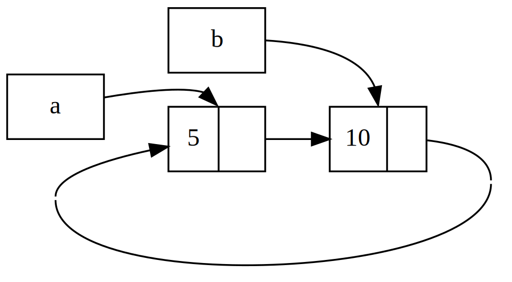

## Ciclos de Referência Podem Vazar Memória

As garantias de segurança de memória de Rust tornam difícil, mas não
impossível, criar acidentalmente memória que nunca é limpa (conhecida como
_vazamento de memória_, ou _memory leak_). Prevenir vazamentos de memória por
completo não é uma das garantias de Rust, o que significa que vazamentos de
memória são seguros em memória em Rust. Podemos ver que Rust permite vazamentos
de memória usando `Rc<T>` e `RefCell<T>`: é possível criar referências em que
itens se referem uns aos outros em um ciclo. Isso cria vazamentos de memória
porque a contagem de referências de cada item no ciclo nunca chegará a 0, e os
valores nunca serão descartados.

### Criando um Ciclo de Referências

Vamos ver como um ciclo de referências pode acontecer e como preveni-lo,
começando com a definição do enum `List` e de um método `tail` na Listagem
15-25.

<Listing number="15-25" file-name="src/main.rs" caption="Uma definição de cons list que armazena um `RefCell<T>` para que possamos modificar para onde uma variante `Cons` está apontando">

```rust
{{#rustdoc_include ../listings/ch15-smart-pointers/listing-15-25/src/main.rs:here}}
```

</Listing>

Estamos usando outra variação da definição de `List` da Listagem 15-5. O
segundo elemento na variante `Cons` agora é `RefCell<Rc<List>>`, o que significa
que, em vez de poder modificar o valor `i32` como fizemos na Listagem 15-24,
queremos modificar o valor `List` para o qual uma variante `Cons` aponta.
Também estamos adicionando um método `tail` para facilitar o acesso ao segundo
item quando temos uma variante `Cons`.

Na Listagem 15-26, adicionamos uma função `main` que usa as definições da
Listagem 15-25. Esse código cria uma lista em `a` e uma lista em `b` que aponta
para a lista em `a`. Depois, ele modifica a lista em `a` para apontar para `b`,
criando um ciclo de referências. Há instruções `println!` ao longo do caminho
para mostrar quais são as contagens de referências em vários pontos desse
processo.

<Listing number="15-26" file-name="src/main.rs" caption="Criando um ciclo de referências de dois valores `List` apontando um para o outro">

```rust
{{#rustdoc_include ../listings/ch15-smart-pointers/listing-15-26/src/main.rs:here}}
```

</Listing>

Criamos uma instância de `Rc<List>` que armazena um valor `List` na variável
`a`, com uma lista inicial de `5, Nil`. Depois, criamos uma instância de
`Rc<List>` que armazena outro valor `List` na variável `b`, que contém o valor
`10` e aponta para a lista em `a`.

Modificamos `a` para que aponte para `b` em vez de `Nil`, criando um ciclo.
Fazemos isso usando o método `tail` para obter uma referência para o
`RefCell<Rc<List>>` em `a`, que colocamos na variável `link`. Então usamos o
método `borrow_mut` no `RefCell<Rc<List>>` para mudar o valor interno de um
`Rc<List>` que armazena um valor `Nil` para o `Rc<List>` em `b`.

Quando executamos esse código, mantendo o último `println!` comentado por
enquanto, obteremos esta saída:

```console
{{#include ../listings/ch15-smart-pointers/listing-15-26/output.txt}}
```

A contagem de referências das instâncias de `Rc<List>` em `a` e `b` é 2 depois
que mudamos a lista em `a` para apontar para `b`. No final de `main`, Rust
descarta a variável `b`, o que diminui a contagem de referências da instância
`Rc<List>` de `b` de 2 para 1. A memória que `Rc<List>` tem no heap não será
descartada nesse ponto, porque sua contagem de referências é 1, não 0. Então,
Rust descarta `a`, o que também diminui a contagem de referências da instância
`Rc<List>` de `a` de 2 para 1. A memória dessa instância também não pode ser
descartada, porque a outra instância de `Rc<List>` ainda se refere a ela. A
memória alocada para a lista permanecerá sem ser coletada para sempre. Para
visualizar esse ciclo de referências, criamos o diagrama da Figura 15-4.



<span class="caption">Figura 15-4: Um ciclo de referências das listas `a` e
`b` apontando uma para a outra</span>

Se você descomentar o último `println!` e executar o programa, Rust tentará
imprimir esse ciclo com `a` apontando para `b`, que aponta para `a`, e assim
por diante, até estourar a pilha.

Comparadas a um programa do mundo real, as consequências de criar um ciclo de
referências nesse exemplo não são muito graves: logo depois que criamos o ciclo
de referências, o programa termina. No entanto, se um programa mais complexo
alocasse muita memória em um ciclo e a mantivesse por muito tempo, o programa
usaria mais memória do que precisava e poderia sobrecarregar o sistema,
fazendo-o ficar sem memória disponível.

Criar ciclos de referências não é fácil, mas também não é impossível. Se você
tiver valores `RefCell<T>` que contêm valores `Rc<T>` ou combinações aninhadas
semelhantes de tipos com mutabilidade interior e contagem de referências, deve
garantir que não está criando ciclos; você não pode contar com Rust para
detectá-los. Criar um ciclo de referências seria um bug de lógica no seu
programa, que você deve minimizar usando testes automatizados, revisões de
código e outras práticas de desenvolvimento de software.

Outra solução para evitar ciclos de referências é reorganizar suas estruturas
de dados de modo que algumas referências expressem ownership e outras não.
Como resultado, você pode ter ciclos compostos por algumas relações de ownership
e algumas relações sem ownership, e apenas as relações de ownership afetam se
um valor pode ou não ser descartado. Na Listagem 15-25, sempre queremos que as
variantes `Cons` tenham ownership de sua lista, então reorganizar a estrutura de
dados não é possível. Vamos olhar para um exemplo usando grafos compostos por
nós pais e nós filhos para ver quando relações sem ownership são uma forma
apropriada de prevenir ciclos de referências.

<!-- Old headings. Do not remove or links may break. -->

<a id="preventing-reference-cycles-turning-an-rct-into-a-weakt"></a>

### Prevenindo Ciclos de Referência Usando `Weak<T>`

Até agora, demonstramos que chamar `Rc::clone` aumenta a `strong_count` de uma
instância de `Rc<T>`, e que uma instância de `Rc<T>` só é limpa se sua
`strong_count` for 0. Você também pode criar uma referência fraca para o valor
dentro de uma instância de `Rc<T>` chamando `Rc::downgrade` e passando uma
referência para o `Rc<T>`. *Referências fortes* são a forma como você
compartilha ownership de uma instância de `Rc<T>`. *Referências fracas* não
expressam uma relação de ownership, e sua contagem não afeta quando uma
instância de `Rc<T>` é limpa. Elas não causarão um ciclo de referências, porque
qualquer ciclo que envolva algumas referências fracas será quebrado quando a
contagem de referências fortes dos valores envolvidos chegar a 0.

Quando você chama `Rc::downgrade`, obtém um ponteiro inteligente do tipo
`Weak<T>`. Em vez de aumentar a `strong_count` na instância de `Rc<T>` em 1,
chamar `Rc::downgrade` aumenta a `weak_count` em 1. O tipo `Rc<T>` usa
`weak_count` para registrar quantas referências `Weak<T>` existem, de forma
semelhante a `strong_count`. A diferença é que `weak_count` não precisa ser 0
para a instância de `Rc<T>` ser limpa.

Como o valor ao qual `Weak<T>` se refere pode ter sido descartado, para fazer
qualquer coisa com o valor para o qual um `Weak<T>` aponta você precisa se
certificar de que o valor ainda existe. Faça isso chamando o método `upgrade`
em uma instância de `Weak<T>`, que retornará um `Option<Rc<T>>`. Você receberá
um resultado `Some` se o valor `Rc<T>` ainda não tiver sido descartado e um
resultado `None` se o valor `Rc<T>` tiver sido descartado. Como `upgrade`
retorna um `Option<Rc<T>>`, Rust garantirá que os casos `Some` e `None` sejam
tratados, e não haverá um ponteiro inválido.

Como exemplo, em vez de usar uma lista cujos itens sabem apenas sobre o próximo
item, criaremos uma árvore cujos itens sabem sobre seus itens filhos _e_ sobre
seus itens pais.

<!-- Old headings. Do not remove or links may break. -->

<a id="creating-a-tree-data-structure-a-node-with-child-nodes"></a>

#### Criando uma Estrutura de Dados em Árvore

Para começar, construiremos uma árvore com nós que sabem sobre seus nós filhos.
Criaremos uma struct chamada `Node` que armazena seu próprio valor `i32`, além
de referências para seus valores filhos `Node`:

<span class="filename">Arquivo: src/main.rs</span>

```rust
{{#rustdoc_include ../listings/ch15-smart-pointers/listing-15-27/src/main.rs:here}}
```

Queremos que um `Node` tenha ownership de seus filhos, e queremos compartilhar
esse ownership com variáveis para que possamos acessar cada `Node` na árvore
diretamente. Para fazer isso, definimos os itens de `Vec<T>` como valores do
tipo `Rc<Node>`. Também queremos modificar quais nós são filhos de outro nó,
então temos um `RefCell<T>` em `children` em torno de `Vec<Rc<Node>>`.

Em seguida, usaremos nossa definição de struct e criaremos uma instância de
`Node` chamada `leaf`, com o valor `3` e sem filhos, e outra instância chamada
`branch`, com o valor `5` e `leaf` como um de seus filhos, como mostrado na
Listagem 15-27.

<Listing number="15-27" file-name="src/main.rs" caption="Criando um nó `leaf` sem filhos e um nó `branch` com `leaf` como um de seus filhos">

```rust
{{#rustdoc_include ../listings/ch15-smart-pointers/listing-15-27/src/main.rs:there}}
```

</Listing>

Clonamos o `Rc<Node>` em `leaf` e o armazenamos em `branch`, o que significa
que o `Node` em `leaf` agora tem dois donos: `leaf` e `branch`. Podemos ir de
`branch` para `leaf` por meio de `branch.children`, mas não há como ir de
`leaf` para `branch`. O motivo é que `leaf` não tem referência para `branch` e
não sabe que eles estão relacionados. Queremos que `leaf` saiba que `branch` é
seu pai. Faremos isso a seguir.

#### Adicionando uma Referência de um Filho para Seu Pai

Para fazer o nó filho saber sobre seu pai, precisamos adicionar um campo
`parent` à definição da struct `Node`. O problema está em decidir qual deve ser
o tipo de `parent`. Sabemos que ele não pode conter um `Rc<T>`, porque isso
criaria um ciclo de referências com `leaf.parent` apontando para `branch` e
`branch.children` apontando para `leaf`, o que faria com que seus valores de
`strong_count` nunca chegassem a 0.

Pensando nas relações de outra forma, um nó pai deve ter ownership de seus
filhos: se um nó pai for descartado, seus nós filhos também devem ser
descartados. No entanto, um filho não deve ter ownership de seu pai: se
descartarmos um nó filho, o pai ainda deve existir. Esse é um caso para
referências fracas!

Então, em vez de `Rc<T>`, faremos o tipo de `parent` usar `Weak<T>`,
especificamente um `RefCell<Weak<Node>>`. Agora nossa definição da struct
`Node` fica assim:

<span class="filename">Arquivo: src/main.rs</span>

```rust
{{#rustdoc_include ../listings/ch15-smart-pointers/listing-15-28/src/main.rs:here}}
```

Um nó poderá se referir ao seu nó pai, mas não terá ownership dele. Na Listagem
15-28, atualizamos `main` para usar essa nova definição, de modo que o nó
`leaf` terá uma forma de se referir ao seu pai, `branch`.

<Listing number="15-28" file-name="src/main.rs" caption="Um nó `leaf` com uma referência fraca para seu nó pai, `branch`">

```rust
{{#rustdoc_include ../listings/ch15-smart-pointers/listing-15-28/src/main.rs:there}}
```

</Listing>

Criar o nó `leaf` é parecido com a Listagem 15-27, com exceção do campo
`parent`: `leaf` começa sem pai, então criamos uma nova instância vazia de
referência `Weak<Node>`.

Nesse ponto, quando tentamos obter uma referência para o pai de `leaf` usando o
método `upgrade`, recebemos um valor `None`. Vemos isso na saída da primeira
instrução `println!`:

```text
leaf parent = None
```

Quando criamos o nó `branch`, ele também terá uma nova referência `Weak<Node>`
no campo `parent`, porque `branch` não tem um nó pai. Ainda temos `leaf` como
um dos filhos de `branch`. Depois que temos a instância de `Node` em `branch`,
podemos modificar `leaf` para dar a ele uma referência `Weak<Node>` para seu
pai. Usamos o método `borrow_mut` no `RefCell<Weak<Node>>` no campo `parent` de
`leaf`, e então usamos a função `Rc::downgrade` para criar uma referência
`Weak<Node>` para `branch` a partir do `Rc<Node>` em `branch`.

Quando imprimimos o pai de `leaf` novamente, dessa vez recebemos uma variante
`Some` contendo `branch`: agora `leaf` pode acessar seu pai! Quando imprimimos
`leaf`, também evitamos o ciclo que acabou em estouro de pilha como tivemos na
Listagem 15-26; as referências `Weak<Node>` são impressas como `(Weak)`:

```text
leaf parent = Some(Node { value: 5, parent: RefCell { value: (Weak) },
children: RefCell { value: [Node { value: 3, parent: RefCell { value: (Weak) },
children: RefCell { value: [] } }] } })
```

A ausência de saída infinita indica que esse código não criou um ciclo de
referências. Também podemos perceber isso olhando para os valores que obtemos
ao chamar `Rc::strong_count` e `Rc::weak_count`.

#### Visualizando Mudanças em `strong_count` e `weak_count`

Vamos ver como os valores de `strong_count` e `weak_count` das instâncias de
`Rc<Node>` mudam criando um novo escopo interno e movendo a criação de `branch`
para dentro desse escopo. Fazendo isso, podemos ver o que acontece quando
`branch` é criado e depois descartado ao sair de escopo. As modificações são
mostradas na Listagem 15-29.

<Listing number="15-29" file-name="src/main.rs" caption="Criando `branch` em um escopo interno e examinando as contagens de referências fortes e fracas">

```rust
{{#rustdoc_include ../listings/ch15-smart-pointers/listing-15-29/src/main.rs:here}}
```

</Listing>

Depois que `leaf` é criado, seu `Rc<Node>` tem uma strong count de 1 e uma weak
count de 0. No escopo interno, criamos `branch` e o associamos a `leaf`; nesse
ponto, quando imprimirmos as contagens, o `Rc<Node>` em `branch` terá uma
strong count de 1 e uma weak count de 1 (por causa de `leaf.parent` apontando
para `branch` com um `Weak<Node>`). Quando imprimirmos as contagens em `leaf`,
veremos que ele terá uma strong count de 2, porque `branch` agora tem um clone
do `Rc<Node>` de `leaf` armazenado em `branch.children`, mas ainda terá uma
weak count de 0.

Quando o escopo interno termina, `branch` sai de escopo e a strong count do
`Rc<Node>` diminui para 0, então seu `Node` é descartado. A weak count de 1
vinda de `leaf.parent` não tem influência sobre se `Node` é descartado ou não,
então não temos nenhum vazamento de memória!

Se tentarmos acessar o pai de `leaf` depois do fim do escopo, receberemos
`None` novamente. No final do programa, o `Rc<Node>` em `leaf` tem uma strong
count de 1 e uma weak count de 0, porque a variável `leaf` agora é novamente a
única referência para o `Rc<Node>`.

Toda a lógica que gerencia as contagens e o descarte de valores está embutida
em `Rc<T>` e `Weak<T>` e em suas implementações da trait `Drop`. Ao especificar
na definição de `Node` que a relação de um filho para seu pai deve ser uma
referência `Weak<T>`, você consegue ter nós pais apontando para nós filhos e
vice-versa sem criar um ciclo de referências e vazamentos de memória.

## Resumo

Este capítulo cobriu como usar ponteiros inteligentes para obter garantias e
trade-offs diferentes daqueles que Rust oferece por padrão com referências
comuns. O tipo `Box<T>` tem tamanho conhecido e aponta para dados alocados no
heap. O tipo `Rc<T>` registra o número de referências a dados no heap para que
os dados possam ter múltiplos donos. O tipo `RefCell<T>`, com sua mutabilidade
interior, nos dá um tipo que podemos usar quando precisamos de um tipo
imutável, mas também precisamos alterar um valor interno desse tipo; ele também
aplica as regras de borrowing em tempo de execução, em vez de em tempo de
compilação.

Também discutimos as traits `Deref` e `Drop`, que possibilitam grande parte da
funcionalidade dos ponteiros inteligentes. Exploramos ciclos de referências que
podem causar vazamentos de memória e como preveni-los usando `Weak<T>`.

Se este capítulo despertou seu interesse e você quer implementar seus próprios
ponteiros inteligentes, consulte [“The Rustonomicon”][nomicon] para mais
informações úteis.

A seguir, falaremos sobre concorrência em Rust. Você até aprenderá sobre alguns
novos ponteiros inteligentes.

[nomicon]: ../nomicon/index.html
