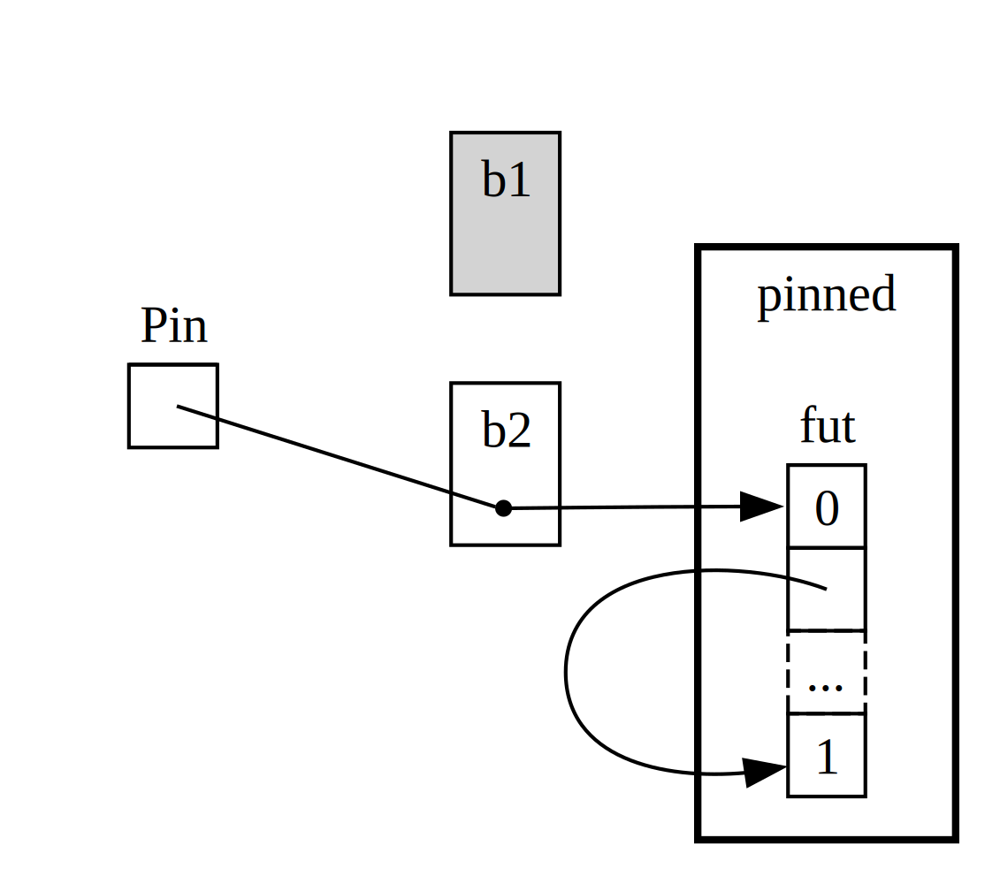

<!-- Old headings. Do not remove or links may break. -->

<a id="digging-into-the-traits-for-async"></a>

## Uma análise mais detalhada das traits de async

Ao longo do capítulo, usamos as traits `Future`, `Stream` e `StreamExt`
de várias maneiras. Até aqui, porém, evitamos entrar muito nos detalhes de
como elas funcionam ou como se encaixam, o que é suficiente na maior parte do
tempo para o trabalho cotidiano com Rust. Às vezes, no entanto, você vai se
deparar com situações em que precisará entender um pouco melhor os detalhes
dessas traits, junto com o tipo `Pin` e a trait `Unpin`. Nesta seção, vamos
nos aprofundar apenas o bastante para ajudar nesses cenários, deixando o
mergulho _realmente_ profundo para outras documentações.

<!-- Old headings. Do not remove or links may break. -->

<a id="future"></a>

### A trait `Future`

Vamos começar olhando mais de perto como a trait `Future` funciona. Veja como
o Rust a define:

```rust
use std::pin::Pin;
use std::task::{Context, Poll};

pub trait Future {
    type Output;

    fn poll(self: Pin<&mut Self>, cx: &mut Context<'_>) -> Poll<Self::Output>;
}
```

Essa definição de trait inclui vários tipos novos e também uma sintaxe que
ainda não vimos, então vamos analisá-la parte por parte.

Primeiro, o tipo associado `Output` de `Future` diz em que valor o future
resulta. Isso é análogo ao tipo associado `Item` da trait `Iterator`.
Em segundo lugar, `Future` tem o método `poll`, que recebe uma referência
especial `Pin` para seu parâmetro `self`, além de uma referência mutável para
um `Context`, e retorna um `Poll<Self::Output>`. Falaremos mais sobre `Pin` e
`Context` daqui a pouco. Por enquanto, vamos focar no que o método retorna, o
tipo `Poll`:

```rust
pub enum Poll<T> {
    Ready(T),
    Pending,
}
```

Esse tipo `Poll` é semelhante a um `Option`. Ele tem uma variante com valor,
`Ready(T)`, e outra sem valor, `Pending`. Mas `Poll` significa algo bem
diferente de `Option`! A variante `Pending` indica que o future ainda tem
trabalho a fazer, então o chamador precisará verificá-lo novamente mais tarde.
A variante `Ready` indica que o `Future` concluiu seu trabalho e que o valor
`T` está disponível.

> Observação: raramente é necessário chamar `poll` diretamente, mas, se você
> precisar, lembre-se de que, com a maioria dos futures, o chamador não deve
> chamar `poll` novamente depois que o future tiver retornado `Ready`. Muitos
> futures entram em `panic!` se forem consultados outra vez depois de ficarem
> prontos. Futures que podem ser consultados novamente com segurança dizem isso
> explicitamente em sua documentação. Isso é semelhante ao comportamento de
> `Iterator::next`.

Quando você vê um código que usa `await`, o Rust o compila internamente para
código que chama `poll`. Se você voltar à Listagem 17-4, em que imprimimos o
título da página de uma única URL quando ela é resolvida, o Rust o compila em
algo mais ou menos assim, embora não exatamente:

```rust,ignore
match page_title(url).poll() {
    Ready(page_title) => match page_title {
        Some(title) => println!("The title for {url} was {title}"),
        None => println!("{url} had no title"),
    }
    Pending => {
        // But what goes here?
    }
}
```

O que devemos fazer quando o future ainda está em `Pending`? Precisamos de
alguma forma de tentar de novo, e de novo, e de novo, até que ele finalmente
esteja pronto. Em outras palavras, precisamos de um loop:

```rust,ignore
let mut page_title_fut = page_title(url);
loop {
    match page_title_fut.poll() {
        Ready(value) => match page_title {
            Some(title) => println!("The title for {url} was {title}"),
            None => println!("{url} had no title"),
        }
        Pending => {
            // continue
        }
    }
}
```

Se o Rust o compilasse exatamente para esse código, porém, cada `await` seria
bloqueante, justamente o oposto do que queremos! Em vez disso, o Rust garante
que o loop possa transferir o controle para algo que consiga pausar o trabalho
nesse future, executar outros futures e depois voltar para verificar este mais
tarde. Como vimos, esse algo é um runtime assíncrono, e esse trabalho de
agendamento e coordenação é uma de suas funções principais.

Na seção [“Enviando dados entre duas tarefas usando passagem de
mensagens”][message-passing]<!-- ignore -->, descrevemos a espera em
`rx.recv`. A chamada a `recv` retorna um future, e aguardar esse future faz com
que ele seja consultado. Observamos que um runtime pausa o future até que ele
fique pronto com `Some(message)` ou com `None`, quando o canal é fechado. Com
essa compreensão mais profunda da trait `Future`, e especificamente de
`Future::poll`, podemos ver como isso funciona. O runtime sabe que o future
não está pronto quando ele retorna `Poll::Pending`. Por outro lado, o runtime
sabe que o future _está_ pronto e o avança quando `poll` retorna
`Poll::Ready(Some(message))` ou `Poll::Ready(None)`.

Os detalhes exatos de como um runtime faz isso estão fora do escopo deste
livro, mas o importante é entender a mecânica básica dos futures: um runtime
faz _poll_ em cada future sob sua responsabilidade e o coloca de volta em
espera quando ele ainda não está pronto.

<!-- Old headings. Do not remove or links may break. -->

<a id="pinning-and-the-pin-and-unpin-traits"></a>
<a id="the-pin-and-unpin-traits"></a>

### O tipo `Pin` e a trait `Unpin`

Voltando à Listagem 17-13, usamos a macro `trpl::join!` para aguardar três
futures. No entanto, é comum ter uma coleção, como um vetor, contendo algum
número de futures que só será conhecido em tempo de execução. Vamos alterar a
Listagem 17-13 para o código da Listagem 17-23, que coloca os três futures em
um vetor e chama a função `trpl::join_all`, que ainda não compilará.

<Listing number="17-23" caption="Aguardando futures em uma coleção"  file-name="src/main.rs">

```rust,ignore,does_not_compile
{{#rustdoc_include ../listings/ch17-async-await/listing-17-23/src/main.rs:here}}
```

</Listing>

Colocamos cada future dentro de um `Box` para transformá-los em _objetos trait_,
assim como fizemos na seção “Retornando erros de `run`” no Capítulo 12.
(Abordaremos objetos trait em detalhes no Capítulo 18.) Usar objetos trait nos
permite tratar cada um dos futures anônimos produzidos por esses tipos como o
mesmo tipo, porque todos implementam a trait `Future`.

Isso pode ser surpreendente. Afinal, nenhum dos blocos async retorna nada, então
cada um produz um `Future<Output = ()>`. Lembre-se, porém, de que `Future` é
uma trait, e o compilador cria uma enumeração exclusiva para cada bloco async,
mesmo quando eles têm tipos de saída idênticos. Assim como você não pode
colocar duas structs manuscritas diferentes em um `Vec`, você também não pode
misturar enums geradas pelo compilador.

Em seguida, passamos a coleção de futures para a função `trpl::join_all` e
aguardamos o resultado. No entanto, isso não compila; aqui está a parte
relevante das mensagens de erro.

<!-- manual-regeneration
listagens de cd/ch17-async-await/listing-17-23
Construção cargo
copie *apenas* o bloco `error` final dos erros
-->

```text
error[E0277]: `dyn Future<Output = ()>` cannot be unpinned
  --> src/main.rs:48:33
   |
48 |         trpl::join_all(futures).await;
   |                                 ^^^^^ the trait `Unpin` is not implemented for `dyn Future<Output = ()>`
   |
   = note: consider using the `pin!` macro
           consider using `Box::pin` if you need to access the pinned value outside of the current scope
   = note: required for `Box<dyn Future<Output = ()>>` to implement `Future`
note: required by a bound in `futures_util::future::join_all::JoinAll`
  --> file:///home/.cargo/registry/src/index.crates.io-1949cf8c6b5b557f/futures-util-0.3.30/src/future/join_all.rs:29:8
   |
27 | pub struct JoinAll<F>
   |            ------- required by a bound in this struct
28 | where
29 |     F: Future,
   |        ^^^^^^ required by this bound in `JoinAll`
```

A observação nessa mensagem de erro nos diz que devemos usar a macro `pin!`
para _fixar_ os valores, isto é, colocá-los dentro do tipo `Pin`, que garante
que eles não serão movidos na memória. A mensagem de erro diz que isso é
necessário porque `dyn Future<Output = ()>` precisa implementar a trait
`Unpin`, e atualmente não implementa.

A função `trpl::join_all` retorna uma struct chamada `JoinAll`. Essa struct é
genérica sobre um tipo `F`, que é restringido a implementar a trait `Future`.
Aguardar diretamente um future com `await` o fixa implicitamente. É por isso
que não precisamos usar `pin!` em todo lugar em que queremos aguardar futures.

No entanto, aqui não estamos aguardando diretamente um future. Em vez disso,
construímos um novo future, `JoinAll`, ao passar uma coleção de futures para a
função `join_all`. A assinatura de `join_all` exige que os tipos dos itens da
coleção implementem a trait `Future`, e `Box<T>` só implementa `Future` se o
`T` encapsulado for um future que implemente a trait `Unpin`.

Isso é bastante coisa para absorver! Para realmente entender, vamos nos
aprofundar um pouco mais em como a trait `Future` funciona na prática,
especialmente em relação ao pinning. Observe novamente sua definição:

```rust
use std::pin::Pin;
use std::task::{Context, Poll};

pub trait Future {
    type Output;

    // Required method
    fn poll(self: Pin<&mut Self>, cx: &mut Context<'_>) -> Poll<Self::Output>;
}
```

O parâmetro `cx` e seu tipo `Context` são a chave para como um runtime
realmente sabe quando verificar um dado future enquanto continua sendo
preguiçoso. Novamente, os detalhes de como isso funciona estão fora do escopo
deste capítulo, e normalmente você só precisa pensar nisso ao escrever uma
implementação personalizada de `Future`. Em vez disso, vamos nos concentrar no
tipo de `self`, porque esta é a primeira vez que vemos um método em que `self`
tem uma anotação de tipo. Uma anotação de tipo para `self` funciona como as
anotações de tipo para outros parâmetros de função, mas com duas diferenças
principais:

- Informa ao Rust qual tipo `self` deve ser para que o método seja chamado.
- Não pode ser qualquer tipo. Está restrito ao tipo em que o método está
  implementado, uma referência ou smart pointer para esse tipo, ou um `Pin` envolvendo um
  referência a esse tipo.

Veremos mais sobre essa sintaxe no [Capítulo 18][ch-18]<!-- ignore -->. Por
enquanto, basta saber que, se quisermos fazer `poll` em um future para verificar
se ele está em `Pending` ou em `Ready(Output)`, precisamos de uma referência
mutável ao tipo encapsulada em `Pin`.

`Pin` é um invólucro para tipos parecidos com ponteiros, como `&`, `&mut`,
`Box` e `Rc`. (Tecnicamente, `Pin` funciona com tipos que implementam as traits
`Deref` ou `DerefMut`, mas isso equivale, na prática, a trabalhar apenas com
referências e smart pointers.) `Pin` não é um ponteiro em si e não tem
comportamento próprio, como `Rc` e `Arc` têm com contagem de referências; ele é
puramente uma ferramenta que o compilador pode usar para impor restrições ao
uso de ponteiros.

Lembrar que `await` é implementado em termos de chamadas a `poll` começa a
explicar a mensagem de erro que vimos antes, mas ela falava em `Unpin`, não em
`Pin`. Então, como exatamente `Pin` se relaciona com `Unpin`, e por que
`Future` precisa que `self` esteja em um tipo `Pin` para chamar `poll`?

Lembre-se de que, como vimos anteriormente neste capítulo, uma série de pontos
de espera (`await`) em um future é compilada em uma máquina de estados, e o
compilador garante que essa máquina de estados siga todas as regras normais de
segurança do Rust, incluindo borrowing e ownership. Para fazer isso funcionar,
o Rust analisa quais dados são necessários entre um ponto `await` e o próximo,
ou entre um ponto `await` e o fim do bloco async. Em seguida, ele cria uma
variante correspondente na máquina de estados compilada. Cada variante recebe o
acesso necessário aos dados que serão usados naquela seção do código-fonte,
seja tomando ownership desses dados ou obtendo uma
referência mutável ou imutável a ele.

Até agora, tudo bem: se tivermos algo errado sobre o ownership ou referências em
um determinado bloco async, o borrow checker nos dirá. Quando queremos nos mover
em torno do future que corresponde a esse bloco - como movê-lo para um `Vec` para
passe para `join_all` – as coisas ficam mais complicadas.

Quando movemos um future - seja inserindo-o em uma estrutura de dados para usá-lo como
iterator com `join_all` ou retornando-o de uma função - isso na verdade significa
mover a máquina de estado que Rust cria para nós. E ao contrário da maioria dos outros tipos em
Rust, o futures Rust criado para blocos async pode acabar com referências a
eles mesmos nos campos de qualquer variante, conforme mostrado na ilustração simplificada da Figura 17-4.

<figure>


<figcaption>Figura 17-4: Um tipo de dado autorreferencial</figcaption>

</figure>

Por padrão, porém, qualquer objeto que tenha uma referência a si mesmo não é seguro para ser movido,
porque as referências sempre apontam para o endereço de memória real de tudo o que elas
consulte (veja a Figura 17-5). Se você mover a própria estrutura de dados, esses
as referências internas serão deixadas apontando para o local antigo. No entanto, isso
a localização da memória agora é inválida. Por um lado, o seu valor não será atualizado
quando você faz alterações na estrutura de dados. Para outra coisa - mais importante,
o computador agora está livre para reutilizar essa memória para outros fins! Você poderia acabar
lendo dados completamente não relacionados mais tarde.

<figure>


<figcaption>Figura 17-5: O resultado inseguro de mover um tipo de dado autorreferencial</figcaption>

</figure>

Teoricamente, o compilador Rust poderia tentar atualizar cada referência para um
objeto sempre que ele é movido, mas isso pode adicionar muita sobrecarga de desempenho,
especialmente se toda uma rede de referências precisar ser atualizada. Se pudéssemos, em vez disso, fazer
certeza de que a estrutura de dados em questão _não se move na memória_, não teríamos
para atualizar quaisquer referências. É exatamente para isso que serve o borrow checker do Rust:
em código seguro, evita que você mova qualquer item com uma referência ativa para
isso.

`Pin ` se baseia nisso para nos dar a garantia exata de que precisamos. Quando _fixamos_ um
valor agrupando um ponteiro para esse valor em`Pin `, ele não poderá mais se mover. Assim,
se você tiver` Pin<Box<SomeType>> `, você realmente fixa o valor` SomeType `, _não_
o ponteiro` Box`. A Figura 17-6 ilustra esse processo.

<figure>


<figcaption>Figura 17-6: Fixando um `Box` que aponta para um tipo de future autorreferencial</figcaption>

</figure>

Na verdade, o ponteiro `Box` ainda pode se mover livremente. Lembre-se: nós nos preocupamos
garantindo que os dados que estão sendo referenciados permaneçam no lugar. Se um ponteiro
se move, _mas os dados para os quais ele aponta_ estão no mesmo lugar, como na Figura
17-7, não há problema potencial. (Como um exercício independente, consulte os documentos
para os tipos, bem como para o módulo `std::pin` e tente descobrir como você faria
isso com um `Pin` envolvendo um `Box`.) A chave é que o tipo autorreferencial
em si não pode se mover, porque ainda está preso.

<figure>



<figcaption>Figura 17-7: Movendo um `Box` que aponta para um tipo de future autorreferencial</figcaption>

</figure>

No entanto, a maioria dos tipos é perfeitamente segura para se movimentar, mesmo que sejam
atrás de um ponteiro `Pin`. Só precisamos pensar em fixar quando os itens tiverem
referências internas. Valores primitivos como números e booleanos são seguros
porque obviamente não têm referências internas.
Nem a maioria dos tipos com os quais você normalmente trabalha no Rust. Você pode se movimentar
um ` Vec`, por exemplo, sem se preocupar. Dado o que vimos até agora, se
você tem um ` Pin<Vec<String>>`, teria que fazer tudo pelo cofre, mas
APIs restritivas fornecidas por ` Pin`, mesmo que um ` Vec<String>`seja sempre seguro
mover se não houver outras referências a ele. Precisamos de uma maneira de dizer ao
compilador que não há problema em mover itens em casos como este - e isso é
onde ` Unpin`entra em ação.

`Unpin ` é um marcador trait, semelhante ao`Send ` e`Sync ` traits que vimos em
Capítulo 16 e, portanto, não possui funcionalidade própria. O marcador traits existe apenas
para informar ao compilador que é seguro usar o tipo que implementa um determinado trait em um
contexto particular.`Unpin` informa ao compilador que um determinado tipo _não_
necessidade de manter quaisquer garantias sobre se o valor em questão pode ser transferido com segurança
movido.

<!--
O `<code>` embutido no próximo bloco é para permitir o `<em>` embutido dentro dele,
  combinando o que o NoStarch faz em termos de estilo e enfatizando o texto aqui
  que é algo distinto de um tipo normal.
-->

Assim como `Send` e `Sync`, o compilador implementa ` Unpin`automaticamente
para todos os tipos onde possa provar que é seguro. Um caso especial, novamente semelhante ao
` Send `e` Sync `, é onde` Unpin `_não_ é implementado para um tipo. O
a notação para isso é <code>impl!Unpin para <em>SomeType</em></code>, onde
<code><em>SomeType</em></code> é o nome de um tipo que _precisa_ ser mantido
essas garantias são seguras sempre que um ponteiro para esse tipo for usado em um` Pin`.

Em outras palavras, há duas coisas a se ter em mente sobre o relacionamento
entre `Pin` e `Unpin`. Primeiro, ` Unpin`é o caso “normal” e `!Unpin` é
o caso especial. Segundo, se um tipo implementa `Unpin` ou `!Unpin` _apenas_
é importante quando você está usando um ponteiro fixado para esse tipo como <code>Pin<&mut
<em>SomeType</em>></code>.

Para tornar isso concreto, pense em um `String`: ele tem um comprimento e o Unicode
personagens que o compõem. Podemos agrupar um ` String`em ` Pin`, como pode ser visto na Figura
17-8. No entanto, ` String`implementa automaticamente ` Unpin`, assim como a maioria dos outros tipos
em Rust.

<figure>


<figcaption>Figura 17-8: Fixando um `String`; a linha pontilhada indica que `String` implementa a trait `Unpin` e, portanto, não fica permanentemente fixado no lugar</figcaption>

</figure>

Como resultado, podemos fazer coisas que seriam ilegais se `String` fosse implementado
`!Unpin `, como substituir uma string por outra exatamente da mesma
localização na memória como na Figura 17-9. Isso não viola o contrato` Pin `,
porque` String `não possui referências internas que tornem sua movimentação insegura.
É exatamente por isso que implementa` Unpin `em vez de`!Unpin`.

<figure>


<figcaption>Figura 17-9: Substituindo o `String` por um `String` totalmente diferente na memória</figcaption>

</figure>

Agora sabemos o suficiente para entender os erros relatados para aquela chamada `join_all`
da Listagem 17-23. Originalmente, tentamos mover o futures produzido por
async é bloqueado em ` Vec<Box<dyn Future<Output = ()>>>`, mas como vimos,
aqueles futures podem ter referências internas, então eles não
implementar ` Unpin`. Depois de fixá-los, podemos passar o tipo ` Pin`resultante para
o ` Vec`, confiante de que os dados subjacentes no futures _não_ serão
movido. A Listagem 17-24 mostra como corrigir o código chamando a macro ` pin!`
onde cada um dos três futures é definido e ajustando o tipo de objeto trait.

<Listing number="17-24" caption="Fixando os futures para permitir movê-los para dentro do vetor">

```rust
{{#rustdoc_include ../listings/ch17-async-await/listing-17-24/src/main.rs:here}}
```

</Listing>

Este exemplo agora compila e executa, e poderíamos adicionar ou remover futures do
vector em tempo de execução e junte todos eles.

`Pin ` e`Unpin` são importantes principalmente para a construção de bibliotecas de nível inferior, ou
quando você está construindo um tempo de execução em si, em vez de usar o código Rust do dia a dia.
Porém, quando você vir esses traits em mensagens de erro, agora você terá uma melhor
ideia de como consertar seu código!

> Nota: Esta combinação de `Pin` e `Unpin` torna possível
> implementar toda uma classe de tipos complexos em Rust que de outra forma seriam
> desafiadores porque são autorreferenciais. Tipos que exigem `Pin` aparecem
> mais comumente em async Rust hoje, mas de vez em quando, você pode ver
>-los em outros contextos também.
>
> As especificidades de como `Pin` e `Unpin` funcionam e as regras necessárias
> para manter, são abordados extensivamente na documentação da API para `std::pin`, então
> se você estiver interessado em aprender mais, esse é um ótimo lugar para começar.
>
> Se você quiser entender como as coisas funcionam nos bastidores com ainda mais detalhes,
> veja os capítulos [2][under-the-hood]<!-- ignore --> e
> [4][pinning]<!-- ignore --> de
> [_Programação Assíncrona em Rust_][async-book].

### A característica `Stream`

Agora que você tem um conhecimento mais profundo sobre `Future`, ` Pin`e ` Unpin`traits, nós
podemos voltar nossa atenção para o ` Stream`trait. Como você aprendeu anteriormente no
capítulo, streams são semelhantes ao iterators assíncrono. Ao contrário de ` Iterator`e
` Future `, entretanto,` Stream `não tem definição na biblioteca padrão a partir de
este escrito, mas _exis_ uma definição muito comum do` futures`crate
usado em todo o ecossistema.

Vamos revisar as definições de `Iterator` e `Future` traits antes
olhando como um `Stream` trait pode mesclá-los. De `Iterator`, nós
temos a ideia de uma sequência: seu método ` next`fornece uma
` Option<Self::Item> `. Do` Future `, temos a ideia de prontidão ao longo do tempo:
seu método` poll `fornece um` Poll<Self::Output> `. Para representar uma sequência de
itens que ficam prontos com o tempo, definimos um` Stream`trait que coloca esses
recursos juntos:

```rust
use std::pin::Pin;
use std::task::{Context, Poll};

trait Stream {
    type Item;

    fn poll_next(
        self: Pin<&mut Self>,
        cx: &mut Context<'_>
    ) -> Poll<Option<Self::Item>>;
}
```

O `Stream` trait define um tipo associado chamado `Item` para o tipo do
itens produzidos pelo stream. Isto é semelhante ao `Iterator`, onde pode haver
zero a muitos itens, e ao contrário de ` Future`, onde há sempre um único
` Output `, mesmo que seja a unidade do tipo` ()`.

`Stream ` também define um método para obter esses itens. Chamamos isso de`poll_next `, para
deixe claro que ele pesquisa da mesma forma que` Future::poll `faz e produz um
sequência de itens da mesma forma que` Iterator::next `faz. Seu tipo de retorno
combina` Poll `com` Option `. O tipo externo é` Poll `, porque deve ser
verificado quanto à prontidão, assim como faz um future. O tipo interno é` Option`,
porque precisa sinalizar se há mais mensagens, assim como um iterator
faz.

Algo muito semelhante a esta definição provavelmente acabará como parte do Rust
biblioteca padrão. Enquanto isso, faz parte do kit de ferramentas da maioria dos tempos de execução,
então você pode confiar nele, e tudo o que abordamos a seguir deve ser aplicado em geral!

Nos exemplos que vimos na seção [“Streams: Futures in Sequence”][streams]<!--
ignore -->, porém, não usamos `poll_next` _ou_ `Stream`, mas
em vez disso, usou ` next`e ` StreamExt`. _Poderíamos_ trabalhar diretamente em termos de
API ` poll_next`escrevendo à mão nossas próprias máquinas de estado ` Stream`, é claro,
assim como _poderíamos_ trabalhar com futures diretamente por meio do método ` poll`. Usando
` await `é muito melhor, porém, e o` StreamExt `trait fornece o` next`
método para que possamos fazer exatamente isso:

```rust
{{#rustdoc_include ../listings/ch17-async-await/no-listing-stream-ext/src/lib.rs:here}}
```

> Nota: A definição real que usamos anteriormente neste capítulo parece um pouco
> diferente disso, pois suporta versões do Rust que ainda não
> suporte ao uso de funções async em traits. Como resultado, fica assim:
>
> ```rust,ignore
> fn next(&mut self) -> Next<'_, Self> where Self: Unpin;
> ```
>
> Esse tipo `Next` é um `struct` que implementa `Future` e nos permite nomear
> o lifetime da referência a `self` com `Next<'_, Self>`, para que ` await`
> pode trabalhar com este método.

O `StreamExt` trait também é o lar de todos os métodos interessantes disponíveis
para usar com streams. `StreamExt` é implementado automaticamente para cada tipo
que implementa `Stream`, mas estes traits são definidos separadamente para permitir o
comunidade para iterar em APIs de conveniência sem afetar os fundamentos
trait.

Na versão do `StreamExt` usada no `trpl` crate, o trait não apenas
define o método `next`, mas também fornece uma implementação padrão de ` next`
que lida corretamente com os detalhes da chamada de ` Stream::poll_next`. Isso significa
que mesmo quando você precisa escrever seu próprio tipo de dados de streaming, você _apenas_ tem
para implementar ` Stream`, e então qualquer pessoa que usar seu tipo de dados poderá usar
` StreamExt`e seus métodos automaticamente.

Isso é tudo que abordaremos nos detalhes de nível inferior desses traits. Para
Para finalizar, vamos considerar como futures (incluindo streams), tarefas e threads, todos
combinem!

[message-passing]: ch17-02-concurrency-with-async.md#sending-data-between-two-tasks-using-message-passing
[ch-18]: ch18-00-oop.html
[async-book]: https://rust-lang.github.io/async-book/
[under-the-hood]: https://rust-lang.github.io/async-book/02_execution/01_chapter.html
[pinning]: https://rust-lang.github.io/async-book/04_pinning/01_chapter.html
[first-async]: ch17-01-futures-and-syntax.html#our-first-async-program
[any-number-futures]: ch17-03-more-futures.html#working-with-any-number-of-futures
[streams]: ch17-04-streams.html
